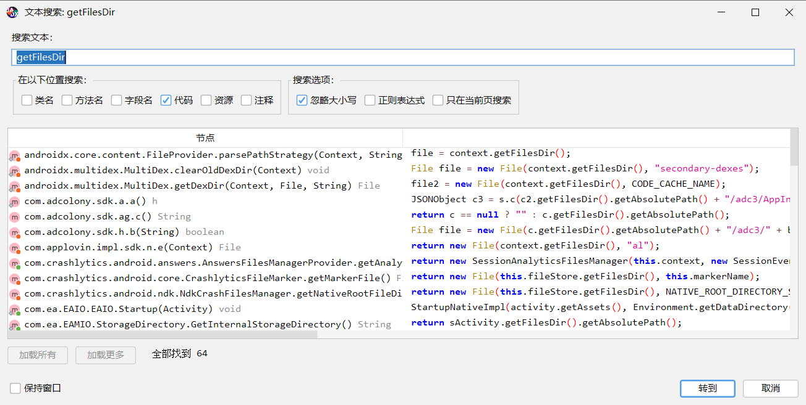
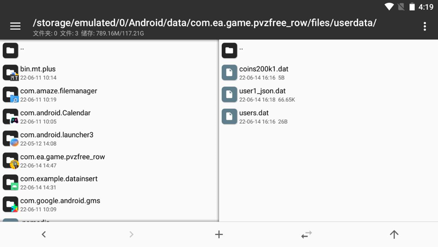

# 将植物大战僵尸安卓版游戏存档路径改到外部存储下（以谷歌free版为例）

## 目标
现在游戏的存档路径为`/data/user/0/包名/files`，需要root才能访问，希望能改到`/storage/emulated/0/Android/data/包名/files`下，无需root即可访问

## 需要了解
 - java
 - smali
 - dex
 - jadx
 - mt管理器

## 思考
 1. 因为不会改so，所以从dex入手
 2. 游戏写入存档文件，肯定要先获取存档文件所在的文件路径，那么找到这个函数，把返回值改为外部路径即可。（当然这是理想情况，也可能找不到这样的函数，也可能找到了但是改了没作用）
 3. 去网上搜索 *android获取数据路径的java函数*，找到了几个，使用测试apk输出一下，得到的路径如图所示\
\
其中`com.example.datainsert`为测试apk的包名，那么对比目标，很明显游戏应该是用的是`getFilesDir()`，我想要改成的是`getExternalFilesDir(null)`

## 实现
 1. 使用jadx进行反编译。将pvzFree2.9.07拖入进去，然后搜索getfilesdir()，发现匹配到了非常多的结果。\
 \
 但仔细观察前面的包名，会发现大部分都是安卓系统类或者广告类。
 2. 先去看一下apk的主activity，发现是`com.ea.game.pvzfree_row.pvzactivity`，那么需要改的地方在com.ea包下的可能性比较大
 3. 我先后改了com.ea包下的rwfilesystem，EAIO，EAMIO三个类里的代码，最后在改了EAMIO之后成功了。这里就以EAMIO为例说一下怎么改。
 4. 在1.中的搜索结果，点进去看一下getFilesDir代码所在位置。

    ```java
    //com.ea.EAMIO.StorageDirectory
        public static String GetInternalStorageDirectory() {
            return sActivity.getFilesDir().getAbsolutePath();
        }

        public static String GetPrimaryExternalStorageDirectory() {
            return sActivity.getExternalFilesDir(null).getAbsolutePath();
        }

    ```
    好家伙，上面是getFilesDir，下面就是我们想要的getExternalFilesDir，那么直接复制粘贴到上面就行了。
 5. 打开mt管理器，进入dex编辑器++，找到对应类，复制粘贴对应函数内容。
    ```smali
    #com.ea.EAMIO.StorageDirectory
    .method public static GetInternalStorageDirectory()Ljava/lang/String;
        .registers 2

        .line 30
        sget-object v0, Lcom/ea/EAMIO/StorageDirectory;->sActivity:Landroid/app/Activity;

        const/4 v1, 0x0

        invoke-virtual {v0, v1}, Landroid/app/Activity;->getExternalFilesDir(Ljava/lang/String;)Ljava/io/File;

        move-result-object v0

        invoke-virtual {v0}, Ljava/io/File;->getAbsolutePath()Ljava/lang/String;

        move-result-object v0

        return-object v0
    .end method
    ```
    修改就完成了。顺便学习一下java里传参是null，smali里传的是0x0
 6. 复制现有的可运行的代码一般不会出问题。如果自己手写的话，需要注意一下开头的`.registers`个数是否足够，因为要一个v1传参。还有就是如果所在的函数比较长，然后用了现有的寄存器，应该看看这个寄存器之前是否存过什么值，之后是否还需要用到这个值，如果需要的话，记得用作传参null之后再把之前的值赋值回去。
 7. 除了修改调用的函数外，还可以暴力返回字符串常量，如`"/storage/emulated/0/Android/data/com.ea.pvzfree_row/files"`。但这样写一是路径错了不容易发现，二是官方文档说getFilesDir这样的函数，在不同情况下的返回值可能不同。也不知道是什么情况，但如果写死的话，可能会有风险，在某些情况下返回的值不符合要求无法识别吧。

## 效果
 - 保存dex，生成apk，安装后打开，发现存档文件出现在了期望的位置，如图\
 