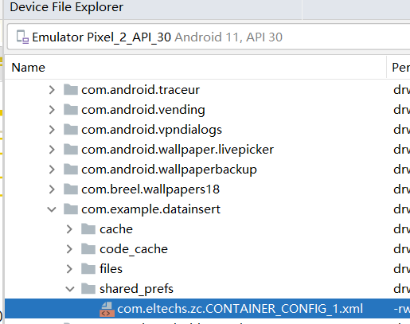
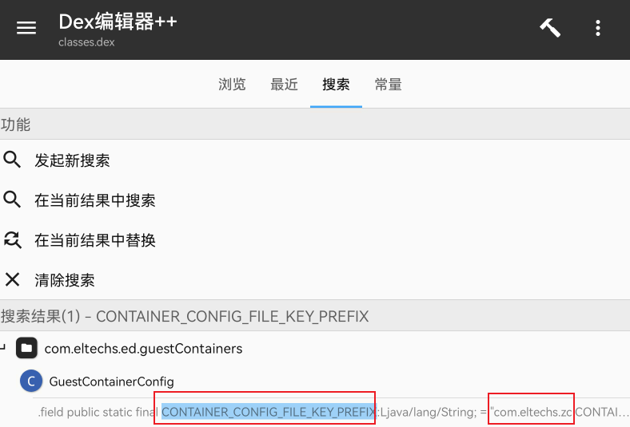

::: tip
本文为[解决exagear内置容器，必须点开一次环境设置才能启动环境的问题](./)的分支，介绍了使用代码生成sharePrefs文件的方法。由于有些局限性，所以本文仅用于留档，建议使用移动现有sharePrefs文件的方法。
:::

## 解决原理
- 缺失的函数为loadDefaults()，其作用为创建SharePreference文件，记录当前容器的设置信息，在创建容器时被调用。所以有两种解决方法:
    - 在初次启动时调用创建环境的代码，创建环境，这样函数就会被执行。
    - 自己写一个sharePref

- 这里选择后者。又有两种选择：
    - 在代码中调用原生方法写入sharepref，
    - 也可以提前写好xml文件放入apk，然后再代码中移动文件到对应目录。

- 我这里选择前者。其实感觉后者更方便修改一点，因为有时候需要自定义按键和分辨率。
 1. 整体思路


    ::: tip 整体思路
    - 编写java代码，测试通过后再转为smali，加入dex中
    - 新建一个类，其包含一个静态方法用于创建SharePref文件，需要传入参数context。
    - 在exagear主Activity里调用该方法，确保程序启动时即可执行。
    - 为什么要在Activity中，而不是随便一个类中调用？因为要获取SharePref文件，所以需要用到context，而context需要从activity中获得。
    :::

 2. 使用AndroidStudio编写代码，创建类ExagearPrefs。文件格式照着GuestContainerConfig写就行。最后写入文件用的是apply同步写入方法，可能造成anr，如果出现问题可以尝试换成commit异步写入。
    ```java
    package com.example.datainsert;

    import android.content.Context;
    import android.content.SharedPreferences;
    import android.util.Log;

    public class ExagearPrefs {
        static public void setSP(Context ctx){
            SharedPreferences sp = ctx.getSharedPreferences("com.eltechs.zc.CONTAINER_CONFIG_1", Context.MODE_PRIVATE);
            //如果没获取到sp就创建一个
            if(sp.getString("NAME","NAME_NOT_FOUND").equals("NAME_NOT_FOUND")){
                SharedPreferences.Editor editor = sp.edit();
    //        Log.d("ExagearPrefs", "setSP: "+sp.getString("NAME","NAME_NOT_FOUND"));
                editor.putString("SCREEN_SIZE","1024,768");
                editor.putString("SCREEN_COLOR_DEPTH","32");
                editor.putString("NAME","预设容器");
                editor.putString("RUN_ARGUMENTS","");
                editor.putString("CONTROLS","default");
                editor.putBoolean("HIDE_TASKBAR_SHORTCUT",false);
                editor.putBoolean("DEFAULT_CONTROLS_NOT_SHORTCUT",false);
                editor.putBoolean("DEFAULT_RESOLUTION_NOT_SHORTCUT",false);
                editor.putString("STARTUP_ACTIONS","");
                editor.putString("RUN_GUIDE","");
                editor.putBoolean("RUN_GUIDE_SHOWN",false);
                editor.putString("CREATED_BY","补补23456"); //用这个检测存不存在吧

                editor.apply(); //同步写入，commit是异步写入
            }else{
                Log.d("ExagearPrefs", "setSP: sp已存在，跳过写入");
            }

        }
    }
    ```
 3. 在主Activity中调用：`ExagearPrefs.setSP(getApplicationContext());`。
 4. 构建项目并在虚拟机中运行，发现可以正常创建SharePref文件。
    


 5. 使用插件将java转为smali，并导入exagear的dex。\
 ExagearPrefs类的导入：进入mt管理器的dex编辑器++，在浏览界面随便长按一个路径然后点击导入，选择smali文件导入。
    
 6. 调用ExagearPrefs代码的导入：将MainActivity也转为smali，找到调用ExgearPrefs的那一行代码。
 **注意这个代码不能直接用。第一行代码为获取`Lcom/example/datainsert/MainActivity`的Context，而在Exagear中应该获取它自己的某个Activity的context，所以我们现在需要将`Lcom/example/datainsert/MainActivity`修改为Exagear某个类的路径，然后放入这个类的OnCreate方法中（Activity生命周期从OnCreate开始）。要求为：必须是Activity，而且在Exagear启动时越早被调用越好。**
    ```smali
    #主Activity中调用函数的代码
    invoke-virtual {p0}, Lcom/example/datainsert/MainActivity;->getApplicationContext()Landroid/content/Context;

    move-result-object v1

    invoke-static {v1}, Lcom/example/datainsert/ExagearPrefs;->setSP(Landroid/content/Context;)V
    ```
7. 寻找我们需要的Activity的方法：（以暗黑直装版为例）打开mt管理器左侧栏-Activity记录，然后启动Exagear，发现第一个启动的类为EDStartupActivity，决定就是它了。所以将第一行的代码对应类名改为Lcom/eltechs/ed/activities/EDStartUpActivity，然后放入EDStartUpActivity的initialiseStartupActions()方法的结尾（恩这个类里没有OnCreate，观察它仅有的几个函数就这个最像初始化函数了）
    ```smali
    #放入EDStartupActivity中initialiseStartupActions()结尾的代码
    invoke-virtual {p0}, Lcom/eltechs/ed/activities/EDStartupActivity;->getApplicationContext()Landroid/content/Context;

    move-result-object v1

    invoke-static {v1}, Lcom/example/datainsert/ExagearPrefs;->setSP(Landroid/content/Context;)V
    ```
    

8. 重新编译dex，apk签名并重装，打开测试，发现不用点开设置也能启动内置环境了，成功。

## 解决实操
本节和 解决原理 后半部分大致相同，省略了解释原理的部分。\
整体思路：分两步，新建一个类用于创建SharePref文件，然后在主Activity中调用这个类。
1. 打开mt管理器的dex编辑器++，在浏览界面长按任意路径，导入[ExagearPrefs.smali](https://pan.baidu.com/s/12SXyCLwy80CP3c-Py0XVEw?pwd=96qs )。该smali用于生成内置环境的设置信息：

    ::: warning
    目前的配置还不够全，有些没配置的选项，比如图形渲染等，正在完善中。。。
    :::

 - （必看！！）25行的com.eltechs.zc这个包名需要根据实际情况修改，否则无法生效。在mt的dex编辑器++中搜索`CONTAINER_CONFIG_FILE_KEY_PREFIX`，查看其对应的字符串前半部分的包名，以这个包名为准。如图中的为`com.eltechs.zc`,那么25行的字符串就应该是`com.eltechs.zc.CONTAINER_CONFIG_1`\
  
 - 58行是分辨率，默认为default，或者其他支持的分辨率，宽高用逗号隔开
 - 65行是色深
 - 72行是环境名称
 - 86行是操作模式，默认为default，或者com.eltechs.ed.controls包里对应操作的类中getId()返回的字符串
2. 使用mt管理器左侧栏的activity记录功能，查看Exagear启动时第一个启动的Activity名字。以图中为例，第一个打开的为com.eltechs.ed.activities.EDStartupActivity
    
3. 将下面三行代码添加到刚才找到的Activity的OnCreate方法的末尾处。
 - 注意第一行代码中的com/eltechs/ed/activities/EDStartupActivity改成刚才找到的Activity名字，点.换成斜线/。
 - 我找的这个EDStartupActivity没有OnCreate，只有一个initialiseStartupActions，把它当OnCreate就行。

    invoke-virtual {p0}, Lcom/eltechs/ed/activities/EDStartupActivity;->getApplicationContext()Landroid/content/Context;

    move-result-object v1

    invoke-static {v1}, Lcom/example/datainsert/ExagearPrefs;->setSP(Landroid/content/Context;)V

4. 编译，重装，测试。