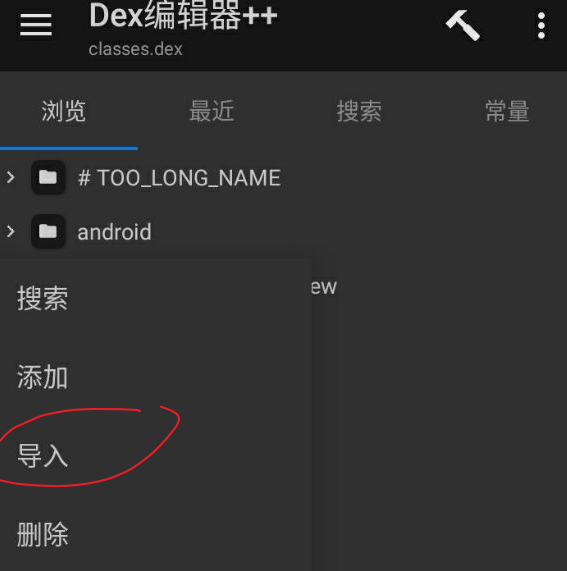

# 解决exagear内置容器，必须点开一次环境设置才能启动环境的问题

::: tip 
本文前半部分为原理，篇幅较长，可以略过，直接看[解决实操](./#解决实操)部分即可
:::

## 问题描述
- 为模拟器添加内置容器，即安装解压后，环境那一页会自动出现一个环境，可以用来制作自定义环境（比如很早之前有人就有人做过的三个内置环境分别对应三个d3d版本。但是这样做会有一个问题，就是直接点环境或者快捷方式启动会闪退，必须要进入一次环境设置（也不需要修改什么选项）。
- 点击添加环境手动创建的环境就没有这个问题。
## 出现原因
- 推测是在点击创建环境的时，调用了某个函数，而内置环境无需操作所以没有触发这个函数。
- 经hostei吧主提示，有可能是缺配置文件`shared_prefs/com.eltechs.ed.CONTAINER_CONFIG_1.xml`
1. 先使用android studio查看debug状态下的报错。如图，screenInfo这个对象没有初始化，导致读取其属性的时候出错了。关键代码在StartGuest类中的413行，使用jadx反编译即可查看。
    
2. 进入jadx，找到其所属的函数为`private static String getWineOptions(ScreenInfo screenInfo, boolean z)`,说明这个screenInfo是外部传来的，再溯源到`public void execute()`，发现传入的screenInfo是自身的成员变量，往上翻几行，发现
    ```java
    if (this.mScreenInfo != null) {
        this.mCont.mConfig.setScreenInfo(this.mScreenInfo);
    } else {
        this.mScreenInfo = this.mCont.mConfig.getScreenInfo();
    }
    ```
3. `getScreenInfo()`所属类为`com.eltechs.ed.guestContainers`，进入这个类查看，发现其成员变量有一个sharepreference，正如hostei吧主所说。类内部的函数`loadDefaults()`则在新建容器时被调用。（新建容器调用的方法为`com.eltechs.ed.guestContainers.GuestContainerConfig`类下的`createContainer()`）
    ```java
    //新建容器时，创建sharePreference文件的函数
    public void loadDefaults() {
        setName("Container_" + this.mCont.mId);
        setScreenInfoDefault();
        setLocaleName(Locales.getLocaleByDevice(this.mContext));
        setRunArguments("");
        setControls(Controls.getDefault());
        setHideTaskbarOnShortcut(false);
        setDefaultControlsNotShortcut(true);
        setDefaultResolutionNotShortcut(true);
        setStartupActions("");
        setRunGuide("");
        setRunGuideShown(false);
    }
    ```
4. 对比sharePreference，发现`loadDefaults()`就是内置环境没有调用的函数。而`createContainer()`中调用它之后也没什么其他的操作了。所以推测闪退原因就是缺少sharePreference文件。
    ```XML
    <!-- SharePreference文件内部结构 -->
    <?xml version='1.0' encoding='utf-8' standalone='yes' ?>
    <map>
        <string name="SCREEN_SIZE">1024,768</string>
        <string name="RUN_ARGUMENTS"></string>
        <boolean name="DEFAULT_CONTROLS_NOT_SHORTCUT" value="false" />
        <boolean name="DEFAULT_RESOLUTION_NOT_SHORTCUT" value="false" />
        <string name="RUN_GUIDE"></string>
        <string name="STARTUP_ACTIONS"></string>
        <string name="CONTROLS">yuhan</string>
        <string name="SCREEN_COLOR_DEPTH">32</string>
        <string name="NAME">预设容器</string>
        <boolean name="HIDE_TASKBAR_SHORTCUT" value="false" />
        <boolean name="RUN_GUIDE_SHOWN" value="false" />
    </map>
    ```


## 解决原理
- 缺失的函数为loadDefaults()，其作用为创建SharePreference文件，记录当前容器的设置信息，在创建容器时被调用。所以有两种解决方法:
    - 在初次启动时调用创建环境的代码，创建环境，这样函数就会被执行。
    - 自己写一个sharePref

- 这里选择后者。又有两种选择：
    - 在代码中调用原生方法写入sharepref，
    - 也可以提前写好xml文件放入apk，然后再代码中移动文件到对应目录。

- ~~我这里选择前者。其实感觉后者更方便修改一点，因为有时候需要自定义按键和分辨率。~~ 已经换成后者了。想看前者的解决方案请点[这里](./detailed)。

1. 整体思路

    ::: tip 整体思路
    - 编写java代码，测试通过后再转为smali，加入dex中
    - 新建一个类，其包含一个静态方法用于移动sharePref文件，从apk中移动到对应目录，需要传入参数context。
    - 在exagear主Activity里调用该方法，确保程序启动时即可执行。
    - 为什么要在Activity中，而不是随便一个类中调用？因为要获取SharePref文件，所以需要用到context，而context需要从activity中获得。
    :::

2. 使用AndroidStudio编写代码，创建类ExagearPrefs。添加setSP方法，通过传入的context，获取apk内assets/containerConfig目录下的全部sharePref文件，并将其移动到应用能识别的位置/包名/shared_prefs目录下。

    ::: details 点击查看代码
    ```java
    static public void setSP(Context ctx) {

        try {
            String[] configs = ctx.getAssets().list("containerConfig");

            if (configs.length == 0)
                throw new Exception("没有环境配置文件");

            //创建share_prefs文件夹
            File dir = new File(ctx.getApplicationInfo().dataDir + "/shared_prefs");
            if (!dir.exists()) {
                boolean b = dir.mkdir();
                assert b;
            }
            ;
            //将文件写入到存档路径中
            for (String datName : configs) {
                Log.i("getAssets().list", datName);

                InputStream is = ctx.getAssets().open("containerConfig/" + datName);      //源文件输入流
                File newFile = new File(dir.getAbsolutePath() + "/" + datName); //创建新文件

                //如果没有，创建该文件
                if (newFile.createNewFile()) {
                    FileOutputStream fos = new FileOutputStream(newFile);                   //新文件输出流
                    int len = -1;
                    byte[] buffer = new byte[4096];
                    while ((len = is.read(buffer)) != -1) {
                        fos.write(buffer, 0, len);
                    }
                    fos.close();
                }
                is.close();
                //Log.i("dataDirectory",getFilesDir().getAbsolutePath()); ///data/user/0/com.example.datainsert/files
            }
            Log.d("ExagearPrefs", "setSP: 现在的sp文件夹：" + Arrays.toString(dir.list()));
        } catch (Exception e) {
            e.printStackTrace();
            Log.d("Exagear", "setSP: 出错：" + e.getMessage());
        }
    }
    ```
    :::

3. 获取xml并放入apk。\
 获取xml：从`/data/data/包名/shared_prefs`目录下获取容器设置xml。命名格式应为`包名.CONTAINER_CONFIG_序号.xml`。包名一般对应模拟器包名，序号从1开始。\
 放入apk：路径为/apk/assets/containerConfig/xxx.xml。可以参考gif演示或[视频演示](/vids/exagearInitContainer/1.mp4)：\
 
 <!-- <video src="/vids/exagearInitContainer/1.mp4" height="300" controls="controls">
 </video> -->

4. 在主Activity中调用：`ExagearPrefs.setSP(getApplicationContext());`。
5. 构建项目并在虚拟机中运行，发现可以正常创建SharePref文件。\
 

6. 使用插件将java转为smali，并导入exagear的dex。\
 ExagearPrefs类的导入：进入mt管理器的dex编辑器++，在浏览界面随便长按一个路径然后点击导入，选择smali文件导入。\
 
7. 调用ExagearPrefs代码的导入：将MainActivity也转为smali，找到调用ExgearPrefs的那一行代码。
 **注意这个代码不能直接用。第一行代码为获取`Lcom/example/datainsert/MainActivity`的Context，而在Exagear中应该获取它自己的某个Activity的context，所以我们现在需要将`Lcom/example/datainsert/MainActivity`修改为Exagear某个类的路径，然后放入这个类的OnCreate方法中（Activity生命周期从OnCreate开始）。要求为：必须是Activity，而且在Exagear启动时越早被调用越好。**
    ```smali
    #主Activity中调用函数的代码
    invoke-virtual {p0}, Lcom/example/datainsert/MainActivity;->getApplicationContext()Landroid/content/Context;

    move-result-object v1

    invoke-static {v1}, Lcom/example/datainsert/ExagearPrefs;->setSP(Landroid/content/Context;)V
    ```
8. 寻找我们需要的Activity的方法：（以暗黑直装版为例）打开mt管理器左侧栏-Activity记录，然后启动Exagear，发现第一个启动的类为EDStartupActivity，决定就是它了。所以将第一行的代码对应类名改为Lcom/eltechs/ed/activities/EDStartUpActivity，然后放入EDStartUpActivity的initialiseStartupActions()方法的结尾（恩这个类里没有OnCreate，观察它仅有的几个函数就这个最像初始化函数了）
    ```smali
    #放入EDStartupActivity中initialiseStartupActions()结尾的代码
    invoke-virtual {p0}, Lcom/eltechs/ed/activities/EDStartupActivity;->getApplicationContext()Landroid/content/Context;

    move-result-object v1

    invoke-static {v1}, Lcom/example/datainsert/ExagearPrefs;->setSP(Landroid/content/Context;)V
    ```
    

9. 将xml也放入模拟器apk，重新编译dex，apk签名并重装，打开测试，发现不用点开设置也能启动内置环境了，成功。

## 解决实操
本节和 解决原理 后半部分大致相同，省略了解释原理的部分。

::: tip 整体思路
1. 在apk文件的/assets/containerConfig/目录下，放入内置容器的设置文件（xml格式）。只要模拟器能读取到这个文件，初次启动就不会闪退。
2. 自己写一个函数，用于将apk里的容器设置信息xml文件移动到对应位置以供模拟器识别。直接用我写好的函数即可：[传送门](https://pan.baidu.com/s/1mDveJsMRVcKkRh9YlfUt8g?pwd=eppn)
3. 在主Activity中调用这个函数

- 后两条需要修改dex。 
:::

1. 将xml文件放入apk

    ::: warning
    如果xml放入apk后没有被移动到对应位置，请仔细检查xml的名字、在apk中路径是否正确
    :::

    - 获取xml\
    这里提供一份来自j改fix39的xml[传送门]()，但是可能不通用。\
    **更好的方法**是从`/data/data/包名/shared_prefs/`目录下提取一份你的模拟器版本对应的xml，此目录需要root，可借助VMOS等工具，这里不过多介绍。
    - 将提取出的xml移入apk。参考gif演示或[视频演示](/vids/exagearInitContainer/1.mp4)：\
    

    需要注意的有：
    - 在apk中存放路径：`apk/assets/containerConfig/xxx.xml`。
    - 文件名\
    不同包名的模拟器，xml文件名也不同。因此建议从`/data/data/包名/shared_prefs/`目录下直接提取现有xml，或者在dex中搜索`CONTAINER_CONFIG_FILE_KEY_PREFIX`查看对应值。
    - 文件个数\
    如果内置多个环境，那么应该创建多个xml放入containerConfig中，并且文件命名\*CONFIG_2.xml、\*CONFIG_3.xml...
    - 文件内容\
    不同版本的模拟器，xml中的内容可能会有不同，应以实际情况为准。

2. 打开mt管理器的dex编辑器++，在浏览界面长按任意路径，导入[ExagearPrefs.smali](https://pan.baidu.com/s/1mDveJsMRVcKkRh9YlfUt8g?pwd=eppn )。该smali包含移动xml文件的函数。

3. 使用mt管理器左侧栏的activity记录功能，查看Exagear启动时调用的Activity名字。以图中为例，第一个调用的为`com.eltechs.ed.activities.EDStartupActivity`，第二个调用的为`com.eltechs.ed.activities.EDMainActivity`。这里采用第一个。\

3. 将下面三行代码添加到刚才找到的Activity的`OnCreate`方法的末尾处。

    ::: tip 注意事项
    - 注意第一行代码中的`com/eltechs/ed/activities/EDStartupActivity`改成刚才找到的Activity名字，点.换成斜线/。
    - 尽量放在OnCreate方法的末尾，因为放中间可能会无意中篡改了v1寄存器的值。
    - 我找的这个EDStartupActivity没有`OnCreate`，只有一个`initialiseStartupActions`，把它当OnCreate就行。
    :::

    ```smali
    invoke-virtual {p0}, Lcom/eltechs/ed/activities/EDStartupActivity;->getApplicationContext()Landroid/content/Context;

    move-result-object v1

    invoke-static {v1}, Lcom/example/datainsert/ExagearPrefs;->setSP(Landroid/content/Context;)V
    ```

5. 编译，重装，测试。

## 总结
- 解决办法就是手动添加SharePreference文件。
- 在测试过程中，发现只要生成sharePref文件并启动一次之后，就算把sharePref删掉也一样能启动。这说明exagear读取sharePref之后又生成了其他文件，第二次往后启动都依靠这个其他文件来启动了。

## 更新历史
1. 发现sharePref的文件名前半部分的包名不是固定的，需要从GuestContainerConfig那看一下
2. 发现自定义的sharePref文件设置项好像不够全面，导致依旧闪退。
3. 干脆重写代码，改成移动现有xml文件到对应目录下。原方法的说明移入[分支页面](./detailed)下
4. 想插入视频但是失败了，还是换回gif演示

<style scoped>
img{
  max-height: 300px;
}
</style>