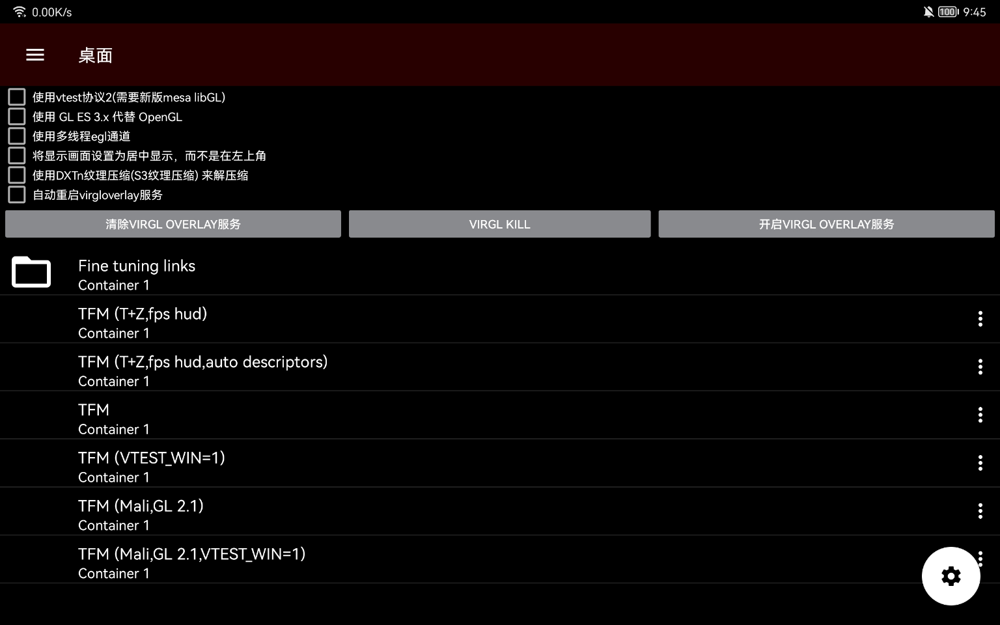

[[TOC]]
## 前言

发现as新建的安卓项目右下角自带了一个圆形按钮，拿来添加一些功能蛮不错。

看规范，其实用于功能整合是错误的，这个操作按钮应该只用于某一个/类明确的操作，不管那么多了=-=

目前已实现的功能：
- [修改D盘路径](./driveD.html)

参考：
- [官网教程](https://developer.android.com/develop/ui/views/components/floating-action-button)（顺便吐槽一下，开发者官网的guide是一些用法示例，reference是api参考。现在又出来一个UI guide是界面相关的用法示例，cn域名还没更新完善，只能用com域名看）
- [material2规范](https://m2.material.io/components/buttons-floating-action-button)（这个也要吐槽一下，从开发者官网跳转过去就到m3，m3又没有这个地址，得手动搜一下）


长这样


## 演示视频：
<!-- 
[【Exagear】鼠标光标变为很小的叉 解决办法](https://www.bilibili.com/video/BV1oe4y1M7Go/?share_source=copy_web&vd_source=de2377a6a91c81456918f0dc49bfbd5d)
<iframe src="//player.bilibili.com/player.html?aid=648320384&bvid=BV1oe4y1M7Go&cid=910849854&page=1" scrolling="no" border="0" frameborder="no" framespacing="0" allowfullscreen="true"> </iframe> -->

## 将此功能添加到apk
推荐使用ED自助补丁一键修改。\
如果你掌握apk的基础修改知识，也可以照下方教程手动修改，但本页面提供的文件可能比ED自助补丁要旧。\
如果ED自助补丁也用不明白，那么应该去寻找已经修改好的apk直接使用。

### 自助修改
使用ED自助补丁，用户完全不需要手动编辑smali，只需点一个按钮，等待修改完成后安装新的apk即可。

[下载地址](https://github.com/ewt45/EDPatch/releases)

[视频介绍](https://www.bilibili.com/video/BV1mY411X7Nn/)

:::warning
以下的修改示例代码，包名使用鲁大师包名`Lcom/ludashi/benchmark/`，请注意根据实际情况自行调整。
:::

### 手动修改
#### 添加悬浮操作按钮
[这是已经改好的apk](https://wwqv.lanzout.com/b012de1zc)(密码:5obi)
，请尽量仅用作本博客所介绍的功能测试用途，因为不保证其他功能正常工作。

[手动添加需要用到的smali压缩包](https://wwqv.lanzout.com/b012de1xa)(密码:6355)。包含悬浮操作按钮和全部目前实现的操作功能。

用MT管理器编辑dex
1. 将上面smali压缩包中的全部smali加入dex中，如果有重复的就覆盖。

2. 在EDMainActivity类的OnCreate方法中，return-void的前一行加上以下代码，以初始化悬浮操作按钮并将其显示到布局上。
    ```smali
        new-instance v3, Lcom/example/datainsert/exagear/FAB/FabMenu;

        invoke-direct {v3, p0}, Lcom/example/datainsert/exagear/FAB/FabMenu;-><init>(Landroid/support/v7/app/AppCompatActivity;)V
    ```

这样就好了。注意虽然菜单可以显示，但如果想功能运行正常，还需要接着看下面对应功能的需要修改的地方。
#### 添加功能-修改D盘路径
编辑dex。
1. 修改EDMainActivity和StartGuest这两个类的成员变量mUserAreaDir，在初始化时调用getDriveDDir()获取用户自定义路径。\
进入这两个类的smali后从上往下滑，找到`.method static constructor <clinit>()V`并修改。

    ```smali
    .method static constructor <clinit>()V
        .registers 3

        .line 51

        #这些删掉
        # new-instance v0, Ljava/io/File;

        # invoke-static {}, Lcom/eltechs/axs/helpers/AndroidHelpers;->getMainSDCard()Ljava/io/File;

        # move-result-object v1

        # const-string v2, "Exagear"

        # invoke-direct {v0, v1, v2}, Ljava/io/File;-><init>(Ljava/io/File;Ljava/lang/String;)V


        # 改为这两行
        invoke-static {}, Lcom/example/datainsert/exagear/FAB/dialogfragment/DriveD;->getDriveDDir()Ljava/io/File;

        move-result-object v0
        # 修改结束，最后一行保留不做更改
        sput-object v0, Lcom/ludashi/benchmark/activities/EDMainActivity;->mUserAreaDir:Ljava/io/File;
        
        return-void
    .end method
    ```
2. 在CreateLaunchConfiguration类的execute方法中，在创建d盘符号链接前删除原有符号链接，以使新设置的路径生效。通过搜索字符串`"/dosdevices/d:"`定位到代码附近，然后参考下面代码在对应位置添加一行代码调用delete()删除文件。
    ```smali

    const-string v6, "/dosdevices/d:"

    invoke-virtual {v5, v6}, Ljava/lang/StringBuilder;->append(Ljava/lang/String;)Ljava/lang/StringBuilder;

    invoke-virtual {v5}, Ljava/lang/StringBuilder;->toString()Ljava/lang/String;

    move-result-object v5

    invoke-direct {v3, v4, v5}, Ljava/io/File;-><init>(Ljava/io/File;Ljava/lang/String;)V
    #添加这一行
    invoke-virtual {v3}, Ljava/io/File;->delete()Z
    #添加结束
    invoke-virtual {v3}, Ljava/io/File;->getAbsolutePath()Ljava/lang/String;

    ```
3. 用户未自定义的情况下，默认设置路径为`/storage/emulated/0/Exagear`。\
如果想将`Exagear`改为其他：在`Lcom/example/datainsert/exagear/FAB/dialogfragment/DriveD`这个类中，修改初始化函数中`PREF_VAL_DST_NAME`的值。

## 探索过程

本节为自用，主要记录实现java代码的过程。

### 设置在父布局中的位置
悬浮操作按钮FloatingActionButton简称fab。


将按钮添加到主界面的布局上，这个在做内置overlay的时候已经搞过了，原理是一样的（虽然说那篇博客的教程也鸽了只有代码修改示例）。基本原理就是找到activity设置的view（id是`0x7f09006e`），然后在activity onCreate的时候把自身传到自己的函数中来，这样先用context创建按钮，然后再用acitivity findViewById寻找主视图，addView就行了。


实际操作发现有个问题，就是新建工程，fab在Coordinatorlayout中，这个类似于framelayout，定位直接`android:layout_gravity="bottom|end"`，然而exagear中用的是LinearLayout，由于中间的列表布局设置了matchParent，导致再添加fab会被挤到到屏幕下面不可见。后来想了想，直接设置负的margin不就好了=-=（实际写代码的时候又在margin说明里看到说这个应该是正数，就用了translationXY）


### 设置图标和颜色
exagear用的导航是drawerLayout，主题应该是用的material的。背景颜色就不管了，让它按主题的来，图标找了一个现有的齿轮向量图标，id是`0x7f0800aa`，虽说不太符合m2规范但是凑活用吧。

通过id寻找资源的时候，由于自己工程的资源id肯定和exagear的不一样，所以调用一个工具函数，传入自己工程的id和ex的id，判断当前包名如果是自己工程就返回自己工程id，否则返回ex的id，这样就不用每次编译完smali都去手动替换id了。

颜色问题，在普通ex上背景蓝色图标黑色，hugo的背景白色图标白色，所以需要根据背景颜色设置图标颜色。这个之前想写自定义按钮颜色后设置按钮文本颜色的时候实现了，大致就是调用ColorUtils判断白色文本的话是否符合最小对比度，如果不符合那就用黑色`int icColor = ColorUtils.calculateMinimumAlpha(Color.WHITE,bgColor,4.5f)==-1 ? Color.BLACK : Color.WHITE;`
，获取图标用`activity.getDrawable`, 设置矢量图表颜色用`iconDrawable.setTintList(ColorStateList.valueOf(icColor));`

设置图标用`fab.setImageDrawable`，但是发现图标不会自适应宽高，所以需要先调用`fab.setCustomSize`设置fab圆的半径。虽然调用setCustomSize，但是不设置fab的layoutParams的宽高还是会有问题，也就是说宽高要设置两边=-=

### 设置点击操作
不会写样式，偶然发现点击的时候有个叫ContextMenu的，[官网教程在这](https://developer.android.google.cn/guide/topics/ui/menus?hl=zh-cn#context-menu)。长按视图后出现一个弹窗菜单，或者全屏的操作。没什么样式不过凑活用吧。

设置setOnCreateContextMenuListener，点击菜单项后显示自定义操作的对话框。\
设置setOnClickListener中调用`fab.showContextMenu()`，这样不需要长按，点击即可出现上下文菜单。

至于点击菜单项后的操作，想了想决定用dialogFragment，这个dialog可以获取context。[官网教程](https://developer.android.google.cn/develop/ui/views/components/dialogs?hl=zh-cn)
于是就用这个了。在OnCreateDialog里返回一个dialog就行。显示它的话就new然后show()，想全屏就用fragment管理器当做fragment处理。

下面是fab构建过程的代码

:::details 点击展开代码
```java
package com.example.datainsert.exagear.FAB;

import android.annotation.SuppressLint;
import android.content.res.ColorStateList;
import android.graphics.Color;
import android.graphics.drawable.Drawable;
import android.support.design.widget.FloatingActionButton;
import android.support.v4.graphics.ColorUtils;
import android.support.v4.graphics.drawable.DrawableCompat;
import android.support.v7.app.AppCompatActivity;
import android.util.Log;
import android.view.Gravity;
import android.view.MenuItem;
import android.view.View;
import android.widget.LinearLayout;

import com.eltechs.axs.helpers.AndroidHelpers;
import com.ewt45.exagearsupportv7.R;
import com.example.datainsert.exagear.FAB.dialogfragment.DriveD;
import com.example.datainsert.exagear.RSIDHelper;

public class FabMenu{
    private static final String TAG = "FabMenu";

    @SuppressLint("RtlHardcoded")
    public FabMenu(AppCompatActivity a) {
        FloatingActionButton fab = new FloatingActionButton(a);
        //不知道为什么，下面设置了customSize，这里如果是wrap content 宽高都变成0
        LinearLayout.LayoutParams params = new LinearLayout.LayoutParams(AndroidHelpers.dpToPx(60), AndroidHelpers.dpToPx(60));//AndroidHelpers.dpToPx(60),AndroidHelpers.dpToPx(60)
        params.gravity = Gravity.TOP | Gravity.RIGHT;
        params.rightMargin = AndroidHelpers.dpToPx(20);
        fab.setTranslationY(-AndroidHelpers.dpToPx(80));//不知道为啥margin那里说应该是正数，那用translation吧
        fab.setElevation(100); //感觉高度舍不设置都无所谓
        fab.setCustomSize(AndroidHelpers.dpToPx(60)); //要用这个设置一遍否则图片不居中
        //设置图标
        try {
            Drawable iconDrawable = a.getDrawable(RSIDHelper.rslvID(R.drawable.ic_menu_camera, 0x7f0800aa));
            //设置icon颜色
            if(fab.getBackgroundTintList()!=null){
                int bgColor = fab.getBackgroundTintList().getDefaultColor() | 0xff000000;

                int icColor = ColorUtils.calculateMinimumAlpha(Color.WHITE,bgColor,4.5f)==-1
                        ? Color.BLACK : Color.WHITE;
                assert iconDrawable != null;
                iconDrawable.setTintList(ColorStateList.valueOf(icColor));
                Log.d(TAG, "FabMenu: 背景色是？"+bgColor+" 选择设置图标颜色为："+icColor);
            }
//            DrawableCompat.setTint();
            fab.setImageDrawable(iconDrawable);
        } catch (Exception ignored) {
        }
        fab.setOnCreateContextMenuListener((menu, v, menuInfo) -> {
            MenuItem item = menu.add(S.f(S.E.DriveD_Title));
            item.setOnMenuItemClickListener(item1 -> {
                new DriveD().show(a.getSupportFragmentManager(), null);
                return true;
            });
        });
        fab.setOnClickListener(view -> fab.showContextMenu());
        //findViewById找到线性布局，添加fab和params

//        View view = a.findViewById(R.id.ed_main_content_frame);
        View view = getMainFrameView(a);
        Log.d("TAG", "FabMenu: 没找到ed_main_content_frame吗" + view);
        if (view instanceof LinearLayout) {
            LinearLayout edFrameLayout = (LinearLayout) view;
            edFrameLayout.addView(fab, params);
        }
    }


    public static View getMainFrameView(AppCompatActivity a) {
        return a.findViewById(RSIDHelper.rslvID(R.id.app_bar_main, 0x7f09006e));
    }

}

```
:::

### 多语言
也不知道怎么设置比较好，反正感觉自己设计的很丑，哈哈。

声明变量locale `String locale = Globals.getAppContext().getResources().getConfiguration().locale.getLanguage();`可以获取当前系统语言的字符串值，2或3个字符，作为返回字符串语言的判断依据。

新建一个工具类S用于处理字符串。

新建几个枚举类E，其每个值代表一个字符串。自身有个stringValue用于记录对应语言的字符串。实现ValueSender接口，重写方法getValue()返回stringValue。每一个枚举类就是一种语言的字符串库存，所以相同含义字符串在不同枚举类中的值名称应该相同。设置其中一个枚举类E为public，用于外部想获取对应字符串的时候的标识，其他为private。

static域初始化map，键和值均为字符串。键名为：字符串对应的枚举类的值+下划线+locale，值为：对应语言的字符串。

当界面需要显示字符串时，调用S.f()获取字符串。f()传入一个枚举类型E的值如E.Dialog_PosBtn。首先检查locale是否获取，没获取就获取一下。
然后首先尝试从map中获取对应语言的字符串值，如果拿到了null，再尝试获取英语的字符串值，如果还是null，就获取中文的字符串值。由于locale只记录了2位，所以没法识别简体中文繁体中文这样细致的差别。

----

当需要添加一个语言的时候，抄一个Enum类，static域里把这个枚举类的值和字符串也加到map里就行了。


## 总结
- aaa
