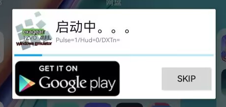

[[TOC]]
## 前言
由于现在exagear安装只能从第三方获取，所以需要用户手动放置数据包。当apk没有在默认位置（/sdcard/Android/obb/包名，现在大部分apk还有一个第二位置 /sdcard）下找到对应文件名（main.数字.包名.obb）的obb文件，就会报错 `failed to find exagear image`。

某些情况下，如不了解obb的用户可能无法检查出问题所在（比如数据包名字前多了几个文字），或者在高版本安卓上无法放入obb文件夹，此时可以通过手动选择的方式来选取obb数据包。


## 演示视频：

<!-- <iframe src="//player.bilibili.com/player.html?aid=648320384&bvid=BV1oe4y1M7Go&cid=910849854&page=1" scrolling="no" border="0" frameborder="no" framespacing="0" allowfullscreen="true"> </iframe> -->

## 将此功能添加到apk
如果你掌握apk的基础修改知识，可以通过本小节的教程将此功能添加到你自己的apk中。如果你是小白，那么应该去找已经修改好的apk直接使用。另外也可以尝试“自助方式”一键修改apk（不稳定）。

<!-- :::warning
以下的修改示例代码，包名使用鲁大师包名`Lcom/ludashi/benchmark/`，请注意根据实际情况自行调整。
::: -->
### 手动修改
用MT管理器编辑dex

1. `com.eltechs.axs.configuration.startup.actions.UnpackExagearImageObb`类，`execute`方法中,将installImageFromObbIfNeeded改为installImageFromObbIfNeededNew，以便显示fragment
    ```smali
    #
    #invoke-virtual {v8}, Lcom/eltechs/axs/helpers/ZipInstallerObb;->installImageFromObbIfNeeded()V
    invoke-virtual {v8}, Lcom/eltechs/axs/helpers/ZipInstallerObb;->installImageFromObbIfNeededNew()V
    ```

2. 在com.eltechs.axs.helpers.ZipInstallerObb类中，结尾处添加installImageFromObbIfNeededNew方法。

    :::details 点击展开代码
    ```smali

    .method public installImageFromObbIfNeededNew()V
        .registers 2
        .annotation system Ldalvik/annotation/Throws;
            value = {
                Ljava/io/IOException;
            }
        .end annotation

        .line 36
        invoke-direct {p0}, Lcom/eltechs/axs/helpers/ZipInstallerObb;->checkObbUnpackNeed()Z

        move-result v0

        if-eqz v0, :cond_10

        invoke-direct {p0}, Lcom/eltechs/axs/helpers/ZipInstallerObb;->findObbFile()Ljava/io/File;

        move-result-object v0

        if-nez v0, :cond_10

        .line 37
        invoke-static {p0}, Lcom/example/datainsert/exagear/obb/ProcessInstallObb;->start(Lcom/eltechs/axs/helpers/ZipInstallerObb;)V

        goto :goto_13

        .line 39
        :cond_10
        invoke-virtual {p0}, Lcom/eltechs/axs/helpers/ZipInstallerObb;->installImageFromObbIfNeeded()V

        :goto_13
        return-void
    .end method
    ```
    :::

3. 在`UnpackExagearImageObb$1.smali`类中（注意名字带`$1`），`unpackingCompleted`方法中，开头添加一句，用于在解压完成后删除临时obb。
    ```smali
    invoke-static {}, Lcom/example/datainsert/exagear/obb/SelectObbFragment;->delCopiedObb()V
    ```

4. 在`com.eltechs.axs.activities.StartupActivity`类中，`onActivityResult`方法中，开头处添加。用于获取手动选择文件。
    ```smali
        # 添加到方法开头。如果相等，用cond正常往下走，否则调用fragment处理文件并goto直接返回
        const/16 v1, 0x2711

        if-eq p1, v1, :cond_3a

        invoke-static {p0, p1, p2, p3}, Lcom/example/datainsert/exagear/obb/SelectObbFragment;->receiveResultManually(Landroid/support/v7/app/AppCompatActivity;IILandroid/content/Intent;)V

        goto :goto_49 #这个goto_49是return-void前的标记，可能不是49是其他数字需要注意一下

        :cond_3a
        #...
        #...
        :goto_49
        return-void
    .end method

    ```

5. 添加[这个压缩包](https://wwqv.lanzout.com/iUMPO0lm9r3i)中的全部类到dex中。

3. 编译dex，重装apk。

### 已改好apk
无
### 自助修改
待补充

<!-- 4. [这是一个已经改好的apk](https://wwqv.lanzout.com/iA2GC0hnjn2f)，请尽量仅用作本博客所介绍的功能测试用途，因为不保证其他功能正常工作。 -->
## 探索过程
本节为自用，主要记录实现java代码的过程。
### 分析ed的dex
UnpackExagearImageObb类里，新建ZipInstallerObb实例，新建一个callback并传入，并调用方法installImageFromObbIfNeeded进行检查并解压数据包。

installImageFromObbIfNeeded先调用checkObbUnpackNeed()判断是否需要解压，如果需要，数据包文件通过findObbFile()获取，然后新建一个AsyncTask，完成的时候调用callback的unpackingCompleted，进而调用UnpackExagearImageObb类里的sendDone方法结束这个action。同理可以显示进度/报错。

findObbFile()方法：先从Android/obb/包名中尝试获取格式化名称的数据包，如果不存在尝试获取根目录下的同名文件。如果这两者有一个获取到了就返回，没获取到就将**versioncode减1再继续找。。**versioncode就是数据包名字中的数字那部分，没想到居然还会向下找。如果啥都找不到，那就返回null。

checkObbUnpackNeed方法：这个方法很绝，依赖于findObbFile，所以如果想获得正确返回值，必须在调用check之前先调用一遍findObbFile。。。

### 打开系统自带的文件选择器
一开始有这个想法是在写切换d盘路径的时候，看到ib键盘007,设置保存安装文件的路径调用了这个。然后搜了一下发现貌似要在manifest里加fileprovider看起来还挺麻烦就放弃了。直到最近写打包apk发现如果只是获取个文件并不用fileprovider（甚至不需要文件存储权限），只需要发送个intent就行了。遂实现了一下。

参考文档：https://developer.android.google.cn/training/data-storage/shared/documents-files?hl=zh-cn#open-file
```java
Intent intent = new Intent(Intent.ACTION_OPEN_DOCUMENT);
intent.addCategory(Intent.CATEGORY_OPENABLE);
intent.setType("*/*");
startActivityForResult(intent, PICK_OBB_FILE);
```
显示一个按钮，点击时发这个intent就行了。然后选择的文件在onActivityResult函数中接收到。所以至少要写个fragment，重写onActivityResult（然而遇到一堆问题），通过第三个参数的intent.getData()获取文件的uri。

### 获取文件并让ex读取到这个文件
uri的api和file的api稍有不同，只能获取到输入流。而ex的解压数据包传参数用的都是file，所以需要先通过文件流复制一份obb数据包到自己的数据目录下（使用apache的commons-io的IOUtils即可，才发现我之前一直用的compress里的IOUtils，不知道有什么区别），然后再把这个拷贝过来的临时obb作为file传给ex以供解压。解压后还应该删掉防止占过多存储空间。

整理一下，流程大概是：ZipInstallerObb中先检查是否需要解压，如果要解压且没找到数据包（findObbFile()返回null），就新建fragment显示手动选择的按钮。\
如何实现解压时获取到复制过来的手动选择的数据包：fragment设置一个静态变量obbFile，在findObbFile()中结尾处，直接返回0（null）改为返回obbFile，当然obbFile初始也是null，只有fragment接收到文件了之后才是对应文件。\
如何实现解压后删除复制过来的手动选择的数据包：解压完成后ZipInstallerObb会调用callbacks.unpackingCompleted()，而callback是在 UnpackExagearImageObb中实现的，所以只需要在这个类里找到unpackingCompleted函数，在其中调用自己的函数删除文件即可。

### onActivityResult的处理
在自己的apk中测试时，并没有什么问题，不过添加到ex中之后遇到了两个问题：
- 获取文件后，首先在activity的onActivityResult里接收到了，而且其中 assert了requestCode，导致不等于10001的都报错。而且fragment压根没接收到。
- 在fragment中调用的startActivityFoResult，在fragment中接收结果时requestCode是对的，但是在activity里接收到的是错的。

又拿自己的apk试了一下，发现原因：
- 结果首先发给活动，活动如果调用super，结果就会发给fragment，ex由于并没有调用super，所以我的fragment接收不到。解决方法：调用自己的静态方法，传入activity的this和原有的三个参数，通过activity获取碎片管理器进而通过tag获取碎片实例，然后再处理结果。至于那个assert，我加了判断如果不等于10001一律调用自己的这个静态方法然后直接返回。
- requestCode不对的问题，原因是[被activity改了](https://stackoverflow.com/questions/10564474/wrong-requestcode-in-onactivityresult)，因为是通过fragment的start发出去的，要么在fragment里接收并处理，要么activity里接收的requestCode&0x0000ffff

在修改smali时，因为需要处理跳转标志，发现用apktool解包的dex，里面标志全变了，数字变成每个函数从0开始。然后如果改了关于标志的代码，编译的时候那些就全变了。

### 如何将fragment挂载到视图上
通过Activity.getSupportFragmentManager().beginTransaction().add方法，add传入三个参数：视图id，fragment实例，fragment的tag，将fragment添加到指定的视图中（测试发现只是添加到最后一个，不会清空其他子视图）。由于必须要视图id，不能视图实例，所以要去xml里找了。。

解压数据包的时候用的是EDStartupActivity，继承自StartupActivity，onCreate的时候设置的布局是start_up.xml。打开xml没想到居然看到了一个隐藏的布局：如下图



好家伙，从来没见过这个。由于设置了visibility=gone，也从来没显示过。而且这个布局是一个有id的线性布局包着的，正好可以拿来用！\
add传入id。show显示fragment，然后设置视图visibility为visible，再把多余的视图去掉，只留一个fragment的根布局即可。（不确定有无重复添加fragment的情况，为以防这种情况下显示多个fragment，先尝试从碎片管理器中获取tag为之前设置的tag的fragment，如果获取到了就不再add了。）


## 总结
- 写一个fragment，显示一个按钮，用来选择文件。
- 启动加载界面的视图有个没显示过的子视图，正好可以拿来挂载fragment。

