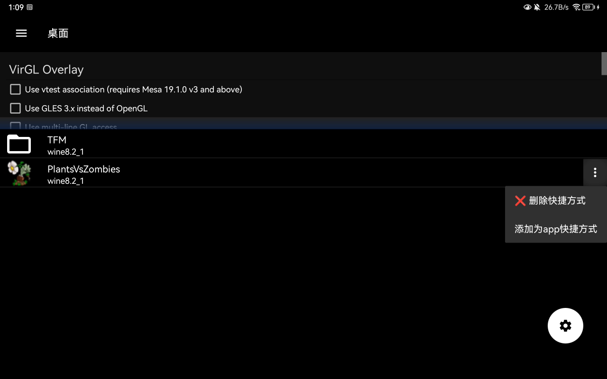
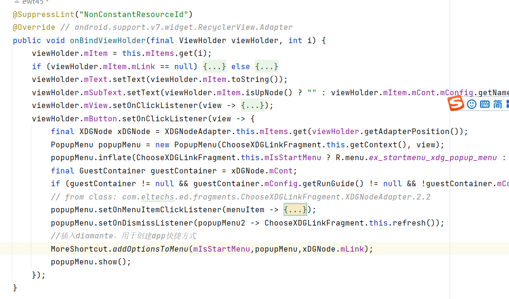
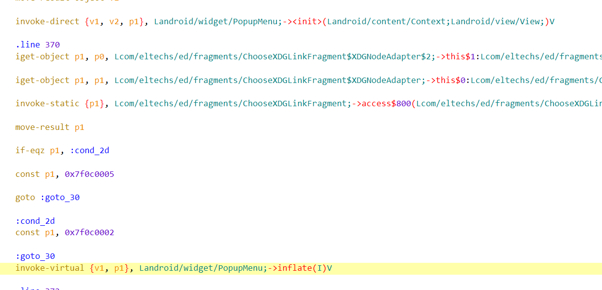

[[TOC]]
## 前言
一般的Exagear运行游戏的流程为：点击exaagear app图标，选择快捷方式或容器设置的运行文件管理器，进入x11界面，打开游戏。而由于exagear代码良好的抽象性，进行非常简单的修改即可直启进入x11界面，直接运行游戏。

效果：


## 演示视频：
[我的合集和视频列表 > exagear](https://space.bilibili.com/29460173/channel/collectiondetail?sid=598657)
<!-- <iframe src="//player.bilibili.com/player.html?aid=648320384&bvid=BV1oe4y1M7Go&cid=910849854&page=1" scrolling="no" border="0" frameborder="no" framespacing="0" allowfullscreen="true"> </iframe> -->

## 将此功能添加到apk
推荐使用ED自助补丁一键修改。\
如果你掌握apk的基础修改知识，也可以照下方教程手动修改，但本页面提供的文件可能比ED自助补丁要旧。\
如果ED自助补丁也用不明白，那么应该去寻找已经修改好的apk直接使用。
<!-- 如果你掌握apk的基础修改知识，可以通过本小节的教程将此功能添加到你自己的apk中。如果你是小白，那么应该去找已经修改好的apk直接使用。如果你不会改apk又不想用现有的已改好的apk，也可以尝试“自助方式”一键修改apk（不稳定）。 -->

:::warning
以下的修改示例代码，包名使用鲁大师包名`Lcom/eltechs/ed/`，请注意根据实际情况自行调整。
:::

### 自助修改
使用ED自助补丁，用户完全不需要手动编辑smali，只需点一个按钮，等待修改完成后安装新的apk即可。

[下载地址](https://github.com/ewt45/EDPatch/releases)

[视频介绍](https://www.bilibili.com/video/BV1mY411X7Nn/)

### 手动修改
用MT管理器编辑dex，

1. 将此压缩包（https://wwqv.lanzout.com/b012zyyli
密码:1mzh）中的全部smali添加到dex中，注意其内容如果有包名相关的请自行替换。 

2. 编辑`com.eltechs.ed.fragments.ChooseXDGLinkFragment$XDGNodeAdapter$2.smali`,在`onClick`方法中，`invoke-virtual {v1}, Landroid/widget/PopupMenu;->show()V`这一行之前，添加：
    ```smali
    iget-object p1, p0, Lcom/eltechs/ed/fragments/ChooseXDGLinkFragment$XDGNodeAdapter$2;->this$1:Lcom/eltechs/ed/fragments/ChooseXDGLinkFragment$XDGNodeAdapter;
    iget-object p1, p1, Lcom/eltechs/ed/fragments/ChooseXDGLinkFragment$XDGNodeAdapter;->this$0:Lcom/eltechs/ed/fragments/ChooseXDGLinkFragment;
    invoke-static {p1}, Lcom/eltechs/ed/fragments/ChooseXDGLinkFragment;->access$800(Lcom/eltechs/ed/fragments/ChooseXDGLinkFragment;)Z
    move-result v2
    iget-object p1, v0, Lcom/eltechs/ed/fragments/ChooseXDGLinkFragment$XDGNode;->mLink:Lcom/eltechs/ed/XDGLink;
    invoke-static {v2, v1, p1}, Lcom/example/datainsert/exagear/shortcut/MoreShortcut;->addOptionsToMenu(ZLandroid/widget/PopupMenu;Lcom/eltechs/ed/XDGLink;)V

    ```
3. 编辑`com.eltechs.ed.activities.EDStartupActivity.smali`，在`initialiseStartupActions`方法结尾处，
    ```smali
    #删除以下几行
    new-instance v0, Lcom/eltechs/ed/startupActions/WDesktop
    invoke-direct {v0}, Lcom/eltechs/ed/startupActions/WDesktop;-><init>()V
    invoke-virtual {v2, v0}, Lcom/eltechs/axs/configuration/startup/StartupActionsCollection;->addAction(Lcom/eltechs/axs/configuration/startup/StartupAction;)V

    # 添加这一行
    invoke-static {p0}, Lcom/example/datainsert/exagear/shortcut/MoreShortcut;->launchFromShortCutOrNormally(Landroid/support/v7/app/AppCompatActivity;)V
    ```


3. 编译dex，重装apk。


## 探索过程
本节为自用，主要记录实现java代码的过程。

### exa直启思路
正常的启动容器流程：在EDStartupActivity中，初始化时会向action列表中添加多个action，每个action依次执行。最后一个是WDesktop，也就是显示启动后的那个安卓视图界面，选择快捷方式或设置容器什么的。再然后选择了快捷方式或启动容器之后，再添加一个action StartGuest用于启动容器，此后进入XServerDisplayAcitivity，显示x11服务。

而StartGuest的创建只需要传入一个参数，如果我们自己新建这个参数，就可以跳过WDesktop，直接在应用初始化时改为添加StartGuest，这样就跳过了安卓视图界面，直接启动x11服务。

两种改法，要么修改现有的EDStartupActivity，根据情况来添加WDesktop（一般启动）或StartGuest（快捷方式启动），要么自己新建一个activity专门用于快捷方式启动。由于新建activity需要改manifest，ed自助补丁还不支持改xml，所以选择前者了。那么这个`根据情况`就可以考虑从调起activity的intent中获取信息。
### app快捷方式
谷歌文档：
https://developer.android.google.cn/develop/ui/views/launch/shortcuts/creating-shortcuts

https://developer.android.google.cn/guide/topics/ui/shortcuts/creating-shortcuts?hl=zh-cn#testing

[有关安卓7的旧版ShortcutManager介绍](https://blog.csdn.net/qibin0506/article/details/52878690)

快捷方式分三种：静态快捷方式，动态快捷方式，和固定快捷方式。静态的需要声明在manifest中且没法修改，动态是可以动态修改的，这两者都是通过长按app图标显示，最多可以显示4个。固定的是单独一个图标放在桌面上，动态快捷方式可以长按然后转换为固定快捷方式。固定快捷方式由于需要安卓版本更高，所以就选择生成动态快捷方式了，使用安卓7及以上的ShortcutManager来创建。

需要构建一个ShortcutInfo，然后通过shortcutManager.setDynamicShortcuts()生成全部快捷方式。

shortcutInfo：
```java
ShortcutInfo shortcutInfo = new ShortcutInfo.Builder(Globals.getAppContext(), xdgLink.name)
        .setShortLabel(xdgLink.name)
        .setExtras(persistableBundle)
        .setIntent(intent) //设置intent又不一定非要指向目标activity，那难道会加到栈中？如果不指定
        .setActivity(new ComponentName(Globals.getAppContext().getPackageName(), Globals.getAppContext().getPackageName() + ".activities.EDStartupActivity")) //设置目标activity
        .build();
```
- Builder传入第二个参数是字符串作为id，id是每个快捷方式的唯一标识，更新啥的根据id判断。
- shortLabel是短名称，建议10个字符以内，还有个长名称建议25个字符以内。
- setActivity用于设置targetActivity，即点击后要跳转到哪个acitivity，不设置的话默认从manifest里找了，设置的话需要传入参数格式如`.setActivity(new ComponentName(Globals.getAppContext().getPackageName(), Globals.getAppContext().getPackageName() + ".activities.EDStartupActivity"))`第一个字符串是应用包名，第二个字符串是activity类的完整路径。吐槽一下这个发现网上基本都没人设置的，然后自己新建ComponentName参数又不知道是啥，试了半天最后还是从logcat的报错信息里看到正确格式的;-;）
- intent看介绍说不一定指向targetAcitivity，反正我是指向了。前面说需要从intent中获取布尔值判断是否从快捷方式启动，就是这个intent了。填充的信息：desktop文件的绝对路径，和其所属的容器id。上面说创建StartGuest这个action需要一个参数，从快捷方式启动的话，这个参数就是XDGLink，而有了这两个数据就可以创建XDGLink对象了。
    ```java
    Intent intent = new Intent(Globals.getAppContext(), EDStartupActivity.class);//Globals.getAppContext(),EDStartupActivity.class
    intent.setAction(Intent.ACTION_MAIN);
    intent.putExtra(DESKTOP_FILE_ABSOLUTE_PATH, xdgLink.linkFile.getAbsolutePath());
    intent.putExtra(CONTAINER_ID, xdgLink.guestCont.mId);
    ```
- extra是记录一般简单数据的。当该app快捷方式对应的.desktop文件被删除之后，app快捷方式本身也应该被删除，所以需要获取该快捷方式对应的desktop文件的文件路径。之前因为看shortcutinfo.getIntent的说明说无法获取到intent，所以又在extra上设置了一遍，不过刚才又看了一下，貌似说的是launcherApp无法获取，shortcutinfo应该能获取。。


### 功能插入的位置
功能写好了，不过需要一个显示功能的地方，一开始想着加到悬浮操作按钮里，但是需要寻找desktop文件路径，还得写回收视图显示文件夹的内容，后来一想不如直接加到现有的快捷方式的那个菜单项里好了（桌面界面的菜单项只有一个删除，开始菜单的菜单项还有一个复制到桌面，虽然不知为何开始菜单这个页面被后人删掉了）



桌面这个页面对应的fragment是ChooseXDGLinkFragment，文件项用的回收视图，回收视图要用到Adapter，这个菜单项的构建就是在ChooseXDGLinkFragment.XDGNodeAdapter.onBindViewHolder中，点击按钮的监听器里实现的。在java代码中写这种套娃顶多就是缩进瞅着别扭点，但是转成smali之后就非常难受了，旧版编译的话内部类，匿名类啥的是`类名$1`这种纯数字命名，新版的$后面可能跟着含义。

下面就简单记载一下寻找流程。

先看一下java中的位置。把能折叠的都折叠上之后，onBindViewHolder内容大概长这样。
popupMenu用于显示菜单项。我们需要在它填充原有内容、设置监听器之后，显示之前插入我们的语句，再添加一项“添加到app快捷方式”。所以MoreShortcut.addOptionsToMenu这行应该加在popupMenu.show()之前。



正常解包的话，每个内部类和匿名类是分成单独文件的，但是在jadx中这些属于同一个java文件中的类都会被显示在同一个页面，所以选择用jadx查看。搜索`Landroid/widget/PopupMenu;->show()V`，定位到唯一一处，往上滑看到其对应的类为`Lcom/eltechs/ed/fragments/ChooseXDGLinkFragment$XDGNodeAdapter$2;`。这已经两层了。

仅把自己的代码调用这一行放到show()上面还不够，因为我们需要准备三个参数：
- mIsStartMenu。这个参数在上面也出现过，是ChooseXDGLinkFragmetn的成员变量，在smali这种原本属于同一个类，但被拆分成不同smali类的情况下，获取外层数据的方法是调用外层类的一个静态函数（名字毫无规律，例如acess$800()这种），传入这个外层类的实例，然后函数内部取得实例的变量值并返回。不过好在上面popupMenu.inflate的时候就获取过一次mIsStartMenu了，所以照着上面的抄应该不难。\
定位到inflate这里\
\
可以看到if-eqz根据p1是否为0，选择了两个不同的资源id，那么p1就是这个isStartMenu（布尔值在smali中也是0和1），看这个p1是怎么获取的：首先调用this.this$1() 将结果（截图没截全，类型是XDGNodeAdapter）放入p1,再调用p1.this$0() 将结果放入p1（类型是ChooseXDGLinkFragment）, 再通过ChooseXDGLinkFragment.access$800(p1) 将结果即mIsStartMenu的值放入p1.\
其中p0是自身类的实例。那么基本流程知道之后，把这几行代码复制过来，最后选一个合适的寄存器存放mIsStartMenu就行了。
- popupMenu。这个比较简单，根据最后一行的`   invoke-virtual {v1}, Landroid/widget/PopupMenu;->show()V`得知popupMenu就是v1一直没变过。
- XDGLink。在fragment内部用于显示的数据是XDGNode，在StartGuest新建时需要的参数是XDGLink，XDGNode包裹了XDGlink但是属于本fragment的私有类，所以没法直接作为参数传到我的类中，要先获取xdgNode.mLink，再传xdglink。这个上面也用到过（java代码截图中的第二行），所以直接往上翻参考其代码就行了。


## 总结
- app快捷方式有三种，静态，动态，固定。前两者在长按app图标时显示，最多显示4个，动态长按可以拖拽变为固定快捷方式显示在桌面。
- 最新的jetpack库有ShortcutManagerCompat方法，用于创建app快捷方式。本次使用了旧版的ShortcutManager创建快捷方式，需要填入intent，目标acitivity等信息。