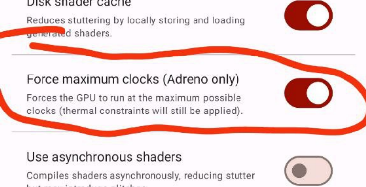
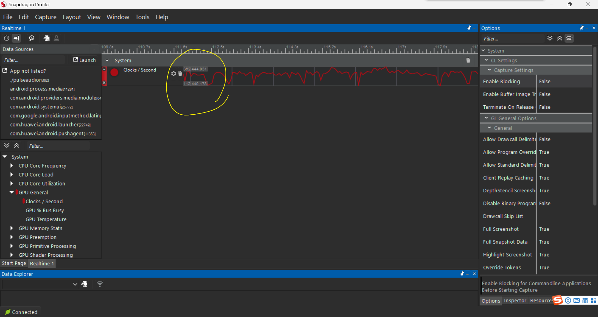

[[TOC]]

## 前言
有个exagear群友问我能不能做一个锁定gpu最大频率的功能，像yuzu等模拟器那样。



去github看了一下源码，发现核心是调用了一个叫`adrenotools_set_turbo(bool);`的函数。该函数属于另外一个项目`libadrenotrools`，该项目的作者是bylaws，ns模拟器skyline开发者之一。

本文记录了android studio + cmake 编译该项目，并在无root情况下观察gpu频率。

## libadrenotools介绍
项目地址：https://github.com/bylaws/libadrenotools

根据readme，这个项目可以让应用免root加载自定义的驱动（如turnip）。设备要求为android 9+, arm64. 锁定gpu最高频率可能只是顺带的一个小功能了，不过我们就需要这个。

观察`adrenotools_set_turbo`函数内容，发现貌似就是向`/dev/kgsl-3d0`设备写了一个属性值。这样一来——
- 既然修改的不是应用自身的属性，而是设备的属性，那么就应该在任何地方修改一次，对全部应用生效（不了解linux，也许不是这样）
- 真的有效吗？搜索得到的root下修改cpu gpu频率的方法：https://zhuanlan.zhihu.com/p/84283694，其中提到了锁定gpu频率之前，需要修改几个额外的属性，否则修改最高频率后可能会被系统自动降频。但adrenotools只改了一个属性`KGSL_PROP_PWRCTRL`，值是true或false。

## 编译为可执行文件
如何在exagear中使用这个功能？一般想在apk中执行c++代码，会添加一个native的java函数，该函数的实现在c++中，调用在java中。但是adrenotools要求64位，exa只有32位so，所以不能写成native函数了，需要做成linux那样的可执行文件，在终端即可运行。

对c++实在是不熟悉，可以算是第一次写cmake了。一开始想在linux编译，无奈不会用ndk，只好在windows上用android studio帮我编译了。
1. 用github desktop下载libadrenotools项目 https://github.com/bylaws/libadrenotools ，可以自动处理子项目依赖（.gitmodules）\
下载后将libadrenotools文件夹移动到 安卓项目\app\src\main\cpp中
2. 按照安卓开发说明，添加CMakeLists.txt（添加过程略）。

    app/CMakeLists.txt中加入以下内容。\
    其中最主要的就是add_executable，将代码编译为可执行文件，运行时自动执行main函数。一般用native java函数这种方式，都是add_library 编译为动态链接库（apk/lib中的那些so）

    
    ```cmake
    set(libadrenotools_DIR src/main/cpp/libadrenotools)
    set(libadrenotools_build_DIR src/main/cpp/libadrenotools/build)
    #引入头文件路径
    include_directories(${libadrenotools_DIR}/include/adrenotools)
    #只支持arm64-v8a
    if( ${CMAKE_ANDROID_ARCH_ABI} STREQUAL arm64-v8a)
        add_subdirectory(${libadrenotools_DIR} ${libadrenotools_build_DIR})
        #生成可执行文件而不是.so，这样可以通过子进程直接运行
        add_executable(gpulock-lock-exe src/main/cpp/gpuclock-lock.c)
        #链接库，否则函数无法调用。这个adrenotools是在其自己的cmakelists中定义的名字
        target_link_libraries(gpulock-lock-exe adrenotools)
    endif()
    ```


3. 创建 src/main/cpp/gpuclock-lock.c

    很简单的函数，如果不传入参数就是关闭，传入参数就是开启。
    ```c
    #include <stdio.h>
    //在cmake里添加了头文件路径
    #include "driver.h"
    int main(int argc, char *argv[]){
        bool enable = argc>1;
        printf("going through main method...boost %s",enable?"enable":"disable");
        adrenotools_set_turbo(enable);
        return 0;
    }

    ```

4. app模块的build.gradle，添加架构支持
    ```gradle
    android.defaultConfig.ndk.abiFilters 'arm64-v8a'
    // 标注CMakeLists.txt位置，我放在了app模块根目录，即与gradle同目录
    android.externalNativeBuild.cmake.path "CMakeLists.txt"
    ```

5. 然后构建apk就行了，构建后生成的可执行文件存在刚才cmakelist中记录的位置 `src/main/cpp/libadrenotools/build`\
生成的文件除了gpulock-lock-exe以外还有4个so，不知道是干啥的反正都留着了。


## 测试结果
提供一个编译好的文件：https://wwqv.lanzout.com/i3Jvj15wmjyj

解压到termux home目录中，授予执行权限并执行
```shell
#为解压后的文件夹内全部文件添加可执行权限
chmod -R +x kgsl 
#进入文件夹中
./gpulock-lock-exe # 关闭
./gpulock-lock-exe 1 # 开启
```

运行是没有报错了，但具体生没生效不知道。无root下查看gpu频率的方法也很稀缺，最后找到了一个高通官方的监测软件 Snapdragon Profiler
https://developer.qualcomm.com/software/snapdragon-profiler ，可以无root监测gpu频率。注册一个账号即可下载。

按照教程连接手机即可。help-documentation 可以查看pdf帮助文档。

点击Start a Session 连接手机，点击 Realtime Performance Analysis 进入实时监测界面，界面左侧下方的列表，选 System - GPU General - Clocks/Second ,双击即可添加到右侧显示区域。



如图所示，黄色圆圈的位置显示的应该就是gpu频率，上面是历史最大频率，下面是平均频率，大概这样。但很可惜，不管是开启还是关闭，这两个数值都不是我的处理器（骁龙865，高通650）的最大频率 587M

然而如果在Start Page 选择 System Trace Analysis，抓取历史最多十秒的gpu频率记录，开启时就是最高频率 587M，关闭时则低于这个数值。


----
结论：
- 测试结果存疑。实时监测 显示gpu没有达到最高频率，抓取历史十秒记录 显示gpu达到最高频率。
- 就实际情况而言，找了两个人测试exagear，对游戏帧数提升几乎没有。猜测原因：
    - 使用的exa apk都是鲁大师伪装包名，即使不使用adrenotools，可能也已经在系统识别到鲁大师包名时提升为最大频率了。
    - 如果cpu遇到瓶颈，仅提升gpu频率也没办法提升帧数。
- 在测试时还有另外一个现象，就是发热减少。不明白为什么会有这个情况，也许与adrenotools无关。但是如果真的有这个效果，那也不错。