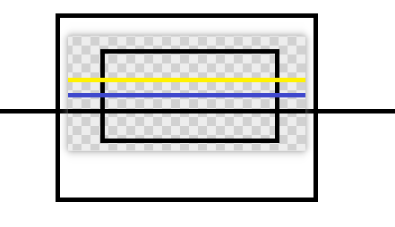

[[TOC]]

## 基础知识

## 绘制文字
使用canvas.drawText 绘制文字。传入参数：文字，起始xy，paint。

----

paint可以用来指定文字大小。
- `mTextPaint.setTextSize(textSize);` 传入像素值，这个设置的貌似是文字高度，因为高度是固定的，但每个字符的宽度是不固定的。
- `mTextPaint.measureText(str)` 测量整个字符串绘制出来的宽度（按当前设置的文字大小）。可以用于和宽度限制对比并缩放文字大小。

但是文字大小越小，字就越细，感觉像是整体缩放的一样，不知道为啥textview就不会这样。

----

绘制时，传入的xy坐标：
- x是默认是文字最左侧位置，可以通过`mTextPaint.setTextAlign(Paint.Align.CENTER);` 设置为文字中央，或者最右侧。
- y是文字基线的位置。基线一般在文字y轴中间偏下的部分，所以需要调整这个值，以便文字能绘制在区域的y轴正中间。
- `mTextPaint.ascent()`  `mTextPaint.descent()` 是基线距离顶部（负数）和距离底部（正数）的距离。由于这两个不等，导致基线对应的y值不是绘制区域正中央的y值。如图所示，基线在黑色横线上。\
\
调整方法：`绘制区域CenterY - (mTextPaint.ascent() + mTextPaint.descent()) / 2f`。ascent和descent加完之后是基线距离上下的差值，就是说基线向上移动这么多之后到上下端的距离就会反过来（即黄线的位置），那么向上移动二分之一这么多就刚好距离上下端大小相等了（即蓝线的位置）。

## 缺点
- 文字大小越小，字就越细，感觉像是整体缩放的一样，不知道为啥textview就不会这样。