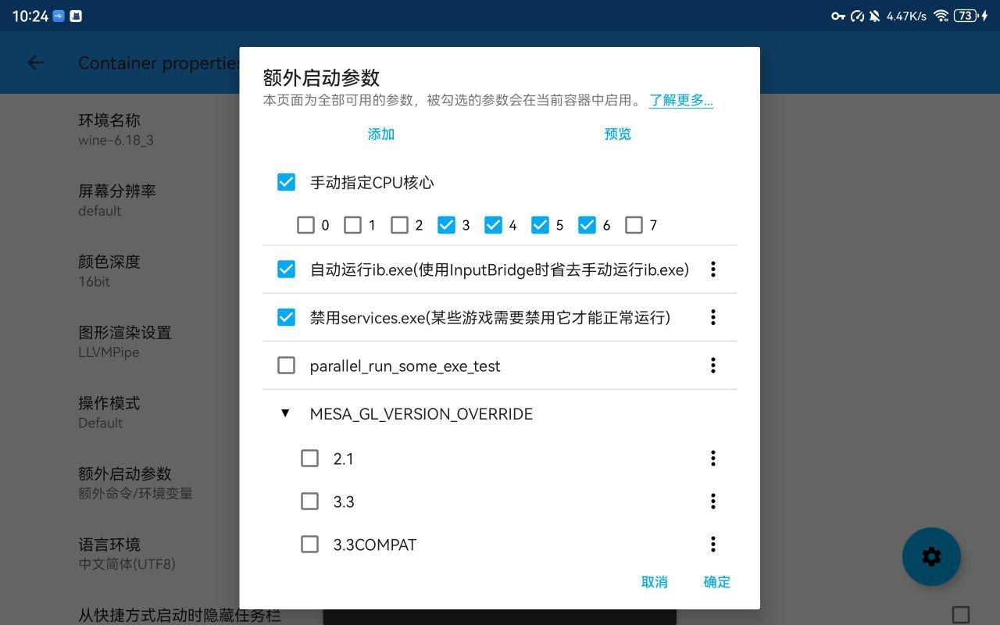

[[TOC]]



## 设计
 - 参数类型
	 - 环境变量（env）
	 - 命令(cmd)
- 插入位置
	- 环境变量位置(env)
	- wine命令开头(front)
	- wine命令前/后（单独命令，加&）(earlier、later)
- 是否启用：开启/关闭
- 别名（用户友好）

- 参数组：包含多个功能类似的子参数，且最多只能有一个被启用。在外部仍然被识别为一个Argument对象。
    - 别名规则：则可以将其别名改为`主名称---副名称`，中间用三个减号分隔。读取txt时会将多个相同主名称，不同副名称的参数合并为一个参数组。

----
存为文本：
- 参数库：edpatch/contArgs.txt。包含全部可使用的参数。
- 每个容器：/home/xdroid_n/contArgs.txt。仅包含部分启用的参数。新建容器时只添加参数库中默认启用（e）的那些参数。

示例
```
d env env KEY=VAL
e cmd front ib
d cmd earlier simple.sh
e cmd later wine taskkill /f /im services.exe
d cmd later run_some_exe wine explorer /desktop=shell taskmgr
d env env MESA_GL_VERSION_OVERRIDE---2.1 MESA_GL_VERSION_OVERRIDE=2.1
d env env MESA_GL_VERSION_OVERRIDE---3.3 MESA_GL_VERSION_OVERRIDE=3.3
d env env MESA_GL_VERSION_OVERRIDE---4.6 MESA_GL_VERSION_OVERRIDE=4.6
```

- 每个容器设置界面都可以修改参数库，但是保存设置时只会更新参数库txt和当前容器txt，所以容器txt的内容可能会滞后，因此容器启用的参数应以参数库中有的为准，容器txt仅用作对比参数库中的某个参数是否应该启用。
----
Argument类
- 基本成员变量
	```java
	public static  String TYPE_ENV = "env", TYPE_CMD = "cmd", TYPE_GROUP="group";
	public static  String POS_ENV = "env", POS_FRONT = "front", POS_EARLIER = "earlier", POS_LATER = "later";
	private boolean mIsEnableByDefault;
	private String mArgType;
	private String mArgPos;
	private String mArg;
	private String mAlias = "";
	private boolean mIsChecked = false; 
	private final List<Argument> mGroup = new ArrayList<>();
	```

- isGroup()用于判断该对象是否为参数组。getCheckedSubParamsInGroup()用于获取参数组中勾选的那个子参数。

## 视图


1. 点击pref选项后显示的dialog：
	- 最上方为两个按钮：添加参数和预览。
	- 用回收视图显示参数库列表。每一项包含：勾选框，别名，操作菜单，第二视图。
	- 拖拽排序

2. 回收视图的item
	- 普通单参数：若勾选，则在当前容器启用。操作菜单可以对其修改或删除。删除是从参数库中删除，所以其他容器也将无法使用该参数。
	- cpu核心选择核心数若启用，则在第二视图显示八个勾选框表示核心选择。
	- 参数组自身没有勾选框和操作菜单。勾选框位置变成下拉按钮，点击后展开第二视图，为其包括的全部子参数。子参数和单参数基本相同，但若勾选一个，则其他的取消勾选。

3. 编辑/添加参数
	- 需要填写：别名，参数内容，类型，新容器是否默认开启
	- 别名不能带空格。
	- 参数不能为空。若为环境变量类型，必须包含等号。
	- 首尾去除空格。
	- 完成编辑时，需要重新判断，当前参数是单参数还是参数组。然后回收视图的adapter notifyChange或insert

4. 删除参数
	- 删除前弹出对话框提示用户该操作会影响全部容器。确认删除后对adapter notifyChange或delete
	- 删除了全局参数库的参数，但最后保存时只会修改当前容器txt，其他容器的数据不会立即更新。所以
	 	1. 在删除时提醒用户，防止用户把这个操作和对当前容器的启用和禁用搞混。
		2. 在容器设置点开dialog时，读取到的参数列表以参数库txt中有的项为准，容器txt仅用于对比某参数是否应该勾选。（但是这样就无法实现容器参数拖拽排序了。。）

5. 预览按钮点击后的dialog
	- 显示原命令实例（可更改）和插入参数后的完整命令。

6. 关闭对话框（txt存储与读取）
	- 显示dialog时，txt读取一次，存为`public final static List<Argument> all` 列表。此后编辑操作均修改该列表。仅在关闭dialog时，将参数库全部参数存到全局txt，并且将勾选的存到容器txt。

----
读取参数库txt：
- isChecked：
	- 当前参数是否勾选，取决于容器txt中是否包含该参数。但还要考虑容器txt不存在时，应该看该参数是否默认启用。
- 每读取新一行时，应首先检查能否和已读取的单参数合并成参数组（参数都以`主名称---`开头）或加入已有参数组（有个参数（实际是参数组）的别名是`主名称`）。如果不能变为参数组，则添加到列表作为新的一项。
- 读取完参数库txt后，若容器txt不存在，则将默认启用的参数写入容器txt。
- 最后将cpu核心设置放到all的第一项。

保存参数库txt时先将第一个作为cpu核心选项存为pref，其他的存到参数库txt，注意参数组需要存入其所有子参数


----

## 代码

注意用了recyclerview回收视图，父布局的滚动视图用NestedScrollView而不是普通的ScrollView。

----

参数组的勾选框要变成下拉按钮。不过可以只用同一个勾选框实现。
- 单参数不设置文字。参数组就隐藏勾选框drawable，并给文字设置成`▶`。
- 代码中隐藏勾选框drawable调用方法`checkbox.setButtonDrawable(null)`

CheckBox自身小于48dp。如果固定宽高48dp的话，纯勾选框或者纯文本没法居中，只好外部再套一个相对布局了。
- 给相对布局自身设置gravity，对全部子布局生效`relative.setGravity(Gravity.CENTER);`
- 设置48dp的初衷是checkbox本身过小不易点击，想要checkbox在相对布局里居中需要wrap_content，这样一来勾选框占地面积又变小了，想要保留初衷，就给相对布局也设置一个点击事件：点相对布局就点一下checkbox `relative.setOnClickListener(v -> checkBox.performClick());`

----

参数别名过长：为统一样式，默认显示一行。点击文字后会展开全部。原本想着用textview自带的方法ScrollingMovementMethod，结果这个由于textview很扁，触摸位置很难保持在文本上，而且还不平滑，就放弃了。

编辑参数的别名时，要求不能包含空格。貌似edittext写Filter还挺麻烦的，干脆写在textchange的监听里，在after里若发现空格就删除。

----

能否在参数组的子参数只剩一个时自动变为单参数样式？.测试结果：可以。调用notifyItemChanged时会重新onCreate和onBind，所以会创建新的holder，viewtype也会随之刷新。

另外注意，在onBindViewHolder时，doc推荐用holder.getAdapterPosition()获取数据项的位置，而不是直接存储传入的参数position。

----

为参数添加别名后，考虑别名本地化的问题：
在代码中设置参数库默认的txt内容时，使用了多语言的别名。
硬编码字符串直接写在了txt中，所以txt一旦生成则无法多语言。
因此，如果modder要自己修改默认参数库内容，则应该在dex中直接修改字符串，而非在obb中内置修改后的txt。

修改参数界面，参数类型添加说明：环境变量: 环境变量会作为本次执行命令的环境变量，原命令开头若包含相同名称的环境变量，则会覆盖该参数的值。\n\n命令：若选择在原命令执行前/后，则此参数的命令与原命令间用一个 & 连接。

----

废弃的构思：

- 视图：ListView https://blog.csdn.net/berber78/article/details/7347217
- item视图可以用android.R.layout.simple_list_item_multiple_choice
- textview 可以从android自带的layout里inflate  android.R.layout.simple_list_item_1，避免过矮或颜色过浅。
- textview 想横向滑动，可以setMovementMethod。但是即使自身高度很高，但是触摸位置不在文本上，而是在空白处，貌似也没法滑动。
	```	        
	textView.setSingleLine(true);
	textView.setMovementMethod(new ScrollingMovementMethod());
	```
- recyclerview永远显示滚动条，自己的apk没问题，加到exagear里报错。只好删了。Attempt to invoke virtual method 'android.widget.ScrollBarDrawable android.widget.ScrollBarDrawable.mutate()' on a null object reference。
	```
	recyclerView.setVerticalScrollBarEnabled(true);
	recyclerView.setScrollbarFadingEnabled(false);
	```
	
## 新知识
### 代码获取主题颜色（attr）
attr为某个属性值，根据主题设置的颜色等自动适配，具体是什么，取决于它定义的返回值是什么类型，可以是style，也可以是integer。

代码中获取attr值，可以用TypedArray。
标题textview，设置深色，可以获取attr值
```java
TypedArray array= c.obtainStyledAttributes(new int[]{android.R.attr.textColorPrimary});
int color = array.getColor(0, Color.BLACK);
array.recycle();
```


----
### 禁止edittext等创建后自动获取焦点
**如何取消edittext焦点**？在根布局设置
```
android:focusable="true" 
android:focusableInTouchMode="true"
```
如果代码中，最好再加上一个`rootWrapper.requestFocus();`
- 根布局是线性布局时没事，NestedScrollView的时候不加这个就没效果
- 这个还解决了用nestedScrollview的时，textview+recyclerview会自动滚动到回收视图开头，textview被顶上去的问题。看来也是回收视图自动获取焦点了。

### 视图变化时添加动画效果
1. TransitionManager: `TransitionManager.beginDelayedTransition(viewGroup)` 这个放在视图修改的代码之前就行。但动画效果并不是很好。

2. LayoutTransition: `viewGroup.setLayoutTransition(new LayoutTransition());` 这个相当于xml里的`animateLayoutChanges=true`，比TransitionManager的效果能好点。默认只支持子布局添加/移除，或visibility变化时。
	- [官方文档](https://developer.android.google.cn/develop/ui/views/animations/prop-animation?hl=zh-cn#layout)
	- [如何支持子布局宽高变化](https://www.jianshu.com/p/1336111f81c9)
	- [LayoutTransition更详细的使用说明](https://blog.csdn.net/yingaizhu/article/details/109526812)


## 待实现

- 目前两个命令的拼接只支持 &。但实际有更多可能 && & || 

- 数据：model类里再添加一个Argument列表吧


- 参数编辑完成时，使是编辑现有，也可能从单参数变为参数组。这里缺少判断

- 拖拽排序 
https://blog.csdn.net/m0_60746014/article/details/125664917
https://developer.android.google.cn/reference/android/support/v7/widget/helper/ItemTouchHelper.Callback#onmove

## 其他无关

顺便一提Process Lasso貌似可以更准确地设置核心

突然发现支持分组之后也可以添加TZ 时区环境变量了。但是从逻辑上来讲，这个环境变量的添加放到

fab里新增一个，读取当前apk全部已安装的功能的版本