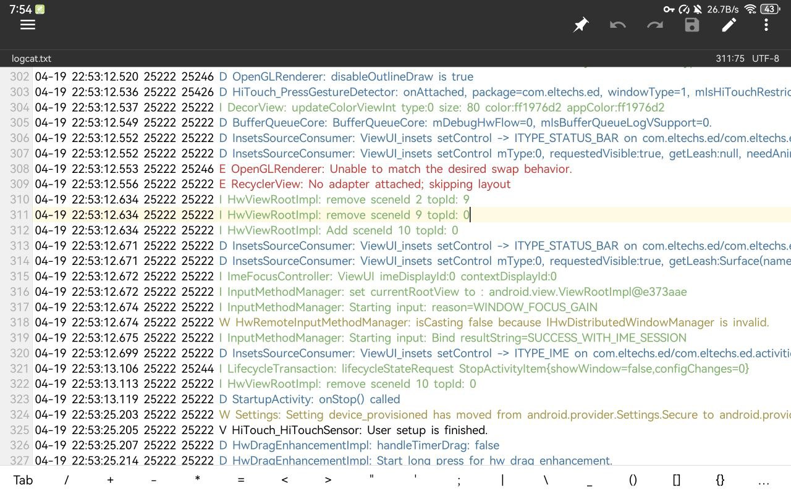

[[TOC]]

## 前言
环境：使用logcat将日志存为文件后，用MT查看。

目标：想给logcat输出的日志高亮一下。主要就是给Error级别的高亮，方便查看报错。

参考：
- [mt语法高亮官方文档](https://mt2.cn/guide/file/mt-syntax.html)
- [谷歌logcat文档](https://developer.android.com/tools/logcat?hl=zh-cn)

最终效果：\


## 输出格式
有好几种
https://developer.android.com/tools/logcat?hl=zh-cn#outputFormat


通过 `-v` 指定，默认是`threadtime`\
格式为：显示日期、调用时间、优先级、标签、PID 以及发出消息的线程的 TID。
```
05-14 11:06:01.491  2328  4244 D WindowManager: WS setWallpaperScale return, wallpaper no need to recover
```

`brief` 是这样的。
```
V/HwWifiServiceFactory( 2328): get AllImpl object = com.android.server.wifi.HwWifiServiceFactoryImpl@f384251
```

还可能有这种，提示进程启动或结束的\
`--------- beginning of crash`

要不就先适配threadtime吧


**格式修饰符**\
https://developer.android.com/tools/logcat?hl=zh-cn#formatmodify \
比如以不同格式显示日期啥的。就先默认的吧，啥也不加的

## 匹配优先级之后的内容
优先级有：
- V：详细（最低优先级）
- D：调试
- I：信息
- W：警告
- E：错误
- F：严重错误
- S：静默（最高优先级，绝不会输出任何内容）

使用到的正则为：
```
/(?<=.*?)\b(?:E|F)\b.*/
```
解释：
- `.*?` 匹配优先级字母前的所有内容。
- `(?<=pattern)内容`返回符合pattern的后面的内容，不包含pattern。
- `\b`匹配单词边界
- `(?:E|F)` 匹配优先级E或F，但不存储结果。也就是说和其他匹配内容合并在一起。
- `.*` 匹配任意字符（除换行外）零次或多次

例如一行文字为\
`05-14 11:06:01.491  2328  4244 D WindowManager: WS setWallpaperScale return, wallpaper no need to recover`

匹配后返回的结果就是\
` D WindowManager: WS setWallpaperScale return, wallpaper no need to recover`

经过一番颜色测试，最终完成。修改后缀为mtsx，点击即可安装。安装后自动对txt和logcat后缀的文件进行高亮。
```
{
    name: ["Logcat", ".txt",".logcat"]
    colors: [
        "info", #80b06d, #80b06d
        "debug", #4874a0, #4874a0
        "warn", #a79652, #a79652
        "error", #bc3f3c, #bc3f3c
    ]
    comment: {startsWith: "//"}
    contains: [

        {match: /(?<=.*?)\b(?:D)\b.*/, 0: "debug"}
        {match: /(?<=.*?)\b(?:I)\b.*/, 0: "info"}
        {match: /(?<=.*?)\b(?:W)\b.*/, 0: "warn"}
        {match: /(?<=.*?)\b(?:E|F)\b.*/, 0: "error"}
    ]
}

```