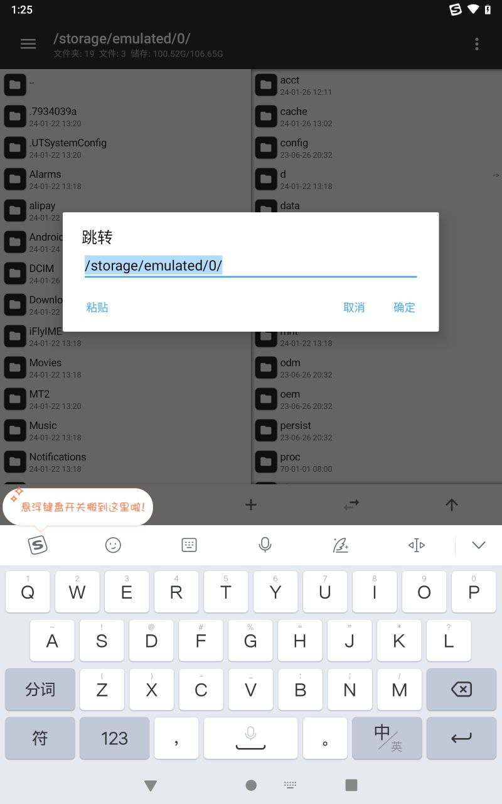
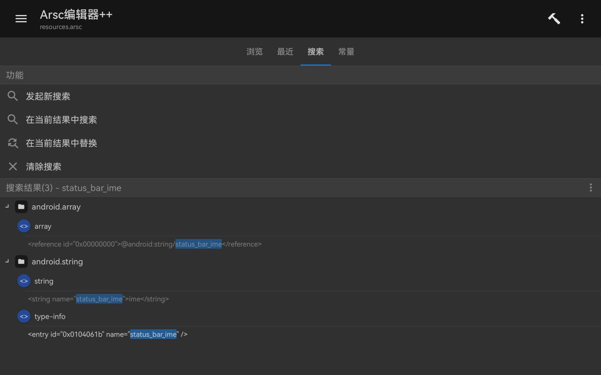
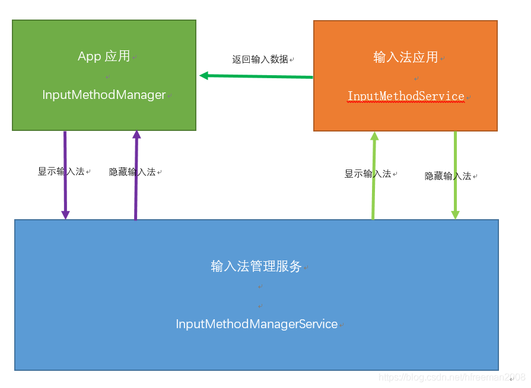
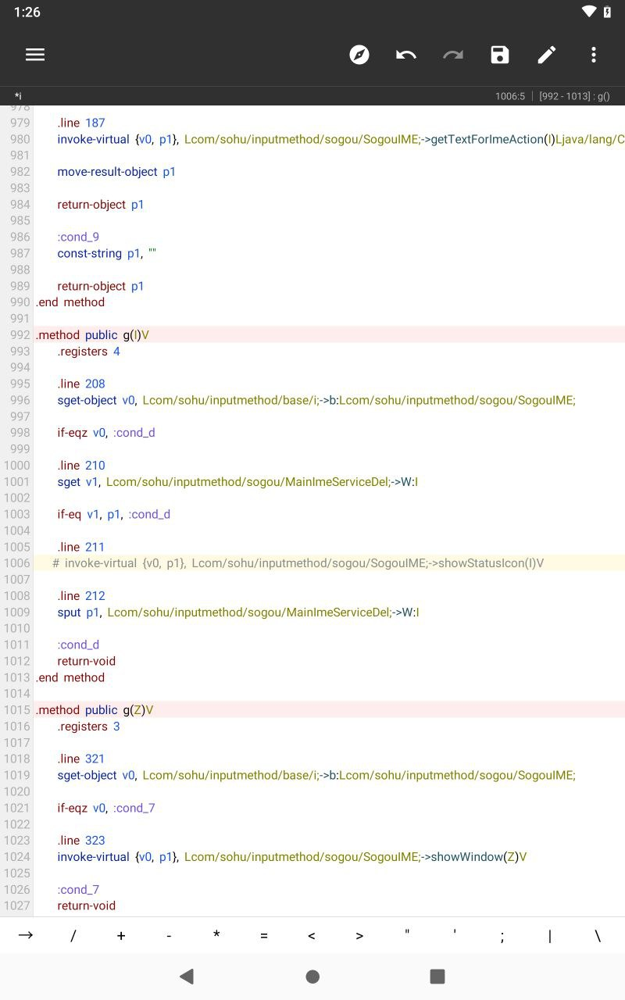

## 问题描述
使用搜狗输入法时，手机顶部状态栏的右侧图标会出现一个搜狗输入法的图标。希望能将其关闭。


## 思考方向
- 可能是系统单独做了适配，在识别到搜狗输入法启动时在右上角显示图标。
- 这个图标也可能是在输入法apk自身存着的，所以可以看看apk的资源文件。
- 尝试搜索引擎搜索关键词：安卓状态栏 右侧图标

## 探究过程

### 系统层面
搜到了一个自定义图标的
[Android状态栏右侧添加图标并控制其显示状态](https://blog.csdn.net/u012894808/article/details/106113865)。里面提到了一个xml可以配置图标\
`在frameworks/base/core/res/res/values/config.xml的string-array name="config_statusBarIcons"中添加我们自己的slot。比如：`\
`<item><xliff:g id="id">@string/status_bar_input_type</xliff:g></item>`

后续是发送广播和接收广播，但是dex中并没有搜到相关广播和intent。

----
又搜到了一个文章[Android系统状态栏定制](https://www.jianshu.com/p/35bf6f2ba16e)，这里提到了状态栏中图标的分布规则如图，也就是说输入法的图标应该属于系统icon。


后续提到了几个java类，`StatusBarIconHolder`, `Slot` 等，在dex中还是搜不到。只搜`StatusBar`倒是能搜到很多，但都是获取状态栏颜色，高度等，没有设置图标相关。

----
又搜到了一个文章[Android IME输入法启动&显示&隐藏流程梳理以及常见问题&调试技巧小结](https://cloud.tencent.com/developer/article/2285144)

太长了，直接搜`status`，发现了这样一句
```java
public class InputMethodManagerService extends IInputMethodManager.Stub
        implements ServiceConnection, Handler.Callback {
        public InputMethodManagerService(Context context) {
            .....
            // 状态栏输入法图标名称, 会根据这个名称设置输入法的图标显示
            mSlotIme = mContext.getString(com.android.internal.R.string.status_bar_ime);
            ......
            }
    ......
        }
```
也就是说获取这个id的字符串时，系统会自动向当前正在使用的输入法请求获取其名称？图标是从输入法app中获取，而非存在系统图标库中？（后面研究发现这里应该是我理解错了）

----
尝试搜索`com.android.internal.R.string.status_bar_ime`相关信息。\
搜到一篇文章[Android SystemUI 状态栏——系统状态图标显示与管理](https://chrisye2015.github.io/2017/08/04/android_systemui_statusbar_systemicons/)，又提到了framework/base/core/res/res/values/config.xml。仔细看了一下，发现确实有status_bar_ime的定义。


突然想到，之前用AndroidKiller的时候，提到过一个framework.jar的东西，我的理解是这里面存着系统预设的一些样式和图标资源等文件，不如直接找到这个文件，去看一下图标在不在里面。

打开vmos进入根目录，很轻松发现了/system/framework/目录下有一个41M的apk，名字叫framework-res.apk。打开arsc一瞧，果然`status_bar_ime`在一个array里面。



但是再仔细一瞧，array里记录的是资源id的id，下面还有一个string类型的资源id的`status_bar_ime`，其对应实际字符串就是`"ime"`三个字母。所以我上面理解的有误，`mSlotIme = mContext.getString(com.android.internal.R.string.status_bar_ime);` 这个获取到的应该是ime三个字母，然后猜测后续操作是把这个作为key，去一个map中寻找它对应的图标。

----
在上面的文章中，发现了一个单词，叫`SystemUI`。于是换个关键词再继续搜索。

发现了这样一篇文章[Android隐藏输入法图标方法——为SystemUI状态栏定制](https://blog.csdn.net/WELL_CODER/article/details/132574091)（还有https://blog.csdn.net/baidu_41666295/article/details/126802001）

bing的搜索结果预览看上去非常美好，甚至直接提到了搜狗输入法。


结果点击去csdn告诉我要花60块钱订阅。。。。搜了一下标题和这段预览文字，也没能找到免费版。（吐槽一下csdn，最近越来越多付费文章了，甚至零几年的文章都变成付费，点开作者头像一看好久没发过文章，很是怀疑csdn看哪篇文章浏览量高直接自动变成付费的，就像csdn下载文件一样）

----

继续翻阅搜索结果，又找到一篇文章[Android 10 SystemUI 如何隐藏状态栏输入法图标](https://blog.csdn.net/wq892373445/article/details/125170985)
这篇文章非常简洁明了，做法是修改`InputMethodManagerService.updateStatusIcon`函数。
`代码路径：
frameworks/base/services/core/java/com/android/server/inputmethod/InputMethodManagerService.java
在InputMethodManagerService.java文件中updateStatusIcon方法中将mStatusBar.setIconVisibility(mSlotIme, true)的true改为false`

看起来非常简单，但不太符合我的需求，因为用户一般没法自己改这种底层代码然后再自己编译。

----

根据那篇付费文章启发，搜索引擎搜素关键词直接写上搜狗输入法，这次搜到了一篇文章：[安卓隐藏搜狗输入法右上角图标](https://blog.csdn.net/decat2008/article/details/109182357)。

更加简洁明了，`adb shell settings put secure icon_blacklist ime` 搞定。看样子是用adb权限修改系统设置，禁用了系统图标中的输入法图标的显示。也就是说以后不管用什么输入法右上角都不会再显示图标了。这个方法还可以。


### 应用层面
问题已经可以解决了，用adb进行全局设置即可。但是有没有别的解决方案呢？既然只有搜狗显示，别的不显示，而且图标也是存在app自身而非系统内，那么这个图标设置一定是在搜狗输入法的代码里完成的。

定位代码的思路：
1. 既然是从app传过去的图标，那在apk/res/drawable这种目录下一定能找到图标，然后dex里搜它资源id就行了
2. 修改系统代码虽然不太可行，但是提供了关键词可以用来搜索：`InputMethodManagerService`
3. 如果不是在dex中设置，也可能是在manifest中声明，比如在`meta-data`里记录图标的资源id，然后系统直接从这读取。

第一种方案尝试了一下就放弃了，因为res下的文件名都是随机字母，还分了无数个子文件夹，这要我找到天荒地老啊（找了一会找到了48x48和60x60的看起来很像的图标，但是dex中没有id调用）。

第三种方案也搜过了，看了所有带`meta-data`和`status`的地方，没有状态栏右上角的那个图标。

万般无奈之下只好搜索`InputMethodManagerService`，(这种一看就是系统层的代码，然后对用户隐藏的，sdk中搜不到，所以想要定位函数或者找函数调用啥的很麻烦。)好在搜到了一篇文章: [android开发浅谈之InputMethodManagerService](https://blog.csdn.net/hfreeman2008/article/details/117963600)。



我们自己实现输入法，需要继承`InputMethodService`类，然后`InputMethodManager`在sdk中也是可见的，只有`InputMethodManagerService`不可见。

先整理一下思路。
- 直接改`InputMethodManagerService.updateStatusIcon`做不到，但是可以做到不调用`updateStatusIcon`，或者保留调用这个函数但是尝试往里传一个不存在的资源id。因此就要寻找都有哪些地方调用了`updateStatusIcon`这个函数。
- 由于这个函数所在类在sdk中找不到，所以想要查找函数调用很不方便。

现在需要解决的问题就是：如何查找`updateStatusIcon`的函数调用。根据上面的图可以发现，这三个类都是紧密相连的，也就是说互相之间都有沟通，那么就可以去另外两个可见类中，搜索是否有对`updateStatusIcon`的调用。

去`InputMethodManager`里搜索`updateStatusIcon`，还真出现了，在`InputMethodManager.showStatusIcon`函数中，根据名字一眼就能明白，调用此函数后，状态栏右侧就会显示输入法图标。但是这个函数被注明废弃，说应该用`InputMethodService.showStatusIcon(int)`。

不管哪个都好，直接去dex里搜`showStatusIcon`，发现只有一处调用



注释掉之后，发现果然状态栏不再显示输入法的系统图标了。左图修改前，右图修改后：


当然，修改apk带来的代价就是：每次启动都会有个Toast：你使用的是盗版应用。不确定后续使用中是否还有其他副作用。

## 总结
- SystemUI：负责系统UI绘制，例如状态栏（顶端），导航栏（底端），通知栏（状态栏下拉）等等。
- 输入法图标所在的位置，对应的是状态栏右侧的系统图标区域，与左侧的应用通知图标稍有不同。
- 可以在应用中调用`InputMethodService.show/hideStatusBar(int)`，来显示/隐藏输入法对应的系统图标，也可以使用`adb shell settings put secure icon_blacklist ime`借助adb禁用输入法系统图标。
- 上面贴的文章中，有一些还介绍了输入法的adb调试相关，例如
    ```shell
    # 列出所有输入法服务
    adb shell ime list -a -s
    # 可以获取到输入法的各种信息, 并且可以过滤window信息
    adb shell dumpsys input_method | grep -i window
    # 获取输入法的窗口状态信息
    adb shell dumpsys window | grep -i input
    ```
